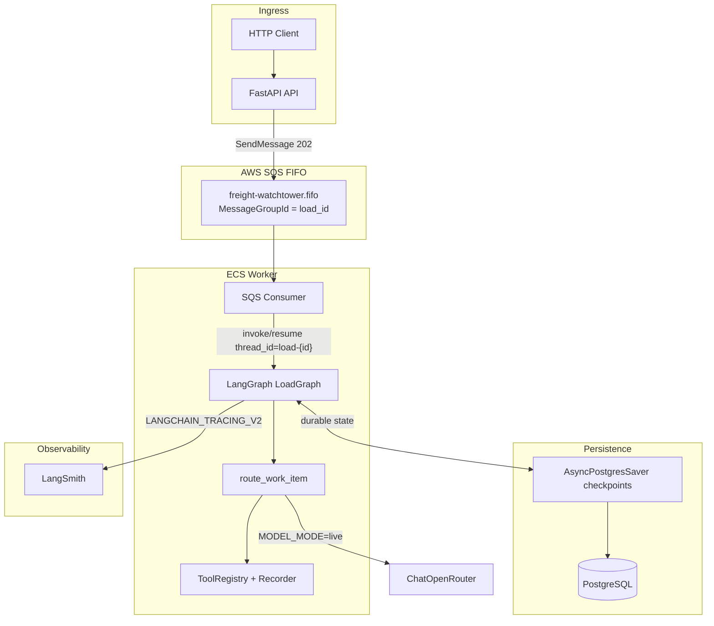
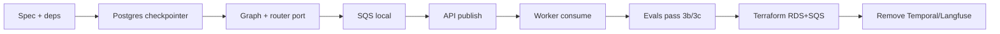

# LangGraph + SQS + Postgres Migration Plan

## Why change

The current stack ([implementation-spec.md](docs/research/implementation-spec.md)) centers on **Temporal** for orchestration/persistence and **Langfuse** for AI traces. Phase 3 works (`3b`/`3c`) but adds operational weight (Temporal Cloud, OTel bootstrap, workflow determinism rules) relative to the challenge’s actual requirements:

- Decoupled API and agent via queue — **SQS FIFO** (you confirmed `MessageGroupId=load_id`)
- Durable per-load state outside memory — **LangGraph `AsyncPostgresSaver`**
- Observability — **LangSmith** (native LangGraph integration)
- LLM — **[ChatOpenRouter](https://reference.langchain.com/python/langchain-openrouter/chat_models/ChatOpenRouter)**

Challenge stack policy explicitly allows any queue/DB/agent framework; this pivot is aligned.

## Target architecture



### Per-load concurrency model

| Concern | Old (Temporal) | New |
| --- | --- | --- |
| Per-load serialization | `workflow_id = load-{load_id}` | SQS FIFO `MessageGroupId=load_id` + LangGraph `thread_id=load-{load_id}` |
| State store | Workflow fields + history | Postgres checkpoints via [AsyncPostgresSaver](https://reference.langchain.com/python/langgraph/checkpoints) |
| API decoupling | Temporal task queue | SQS publish; API never calls the graph |
| Crash recovery | Event replay | [Durable execution](https://docs.langchain.com/oss/python/langgraph/durable-execution) + checkpoint resume (`invoke(None, config)`) |
| Timers | `asyncio.sleep` in workflow | `create_timer` schedules delayed SQS message (same FIFO group); timer payload re-enters graph |

### Processing model (one message = one graph step)

Replace the infinite `LoadWorkflow` loop with **checkpointed incremental invocations**:

1. API enqueues a `WorkItem` JSON (`kind`: `seed` | `event` | `task` | `timer`, `load_id`, `payload`).
2. Worker receives message → `graph.ainvoke(input, config)` with `configurable.thread_id = f"load-{load_id}"`.
3. Graph node runs existing [`route_work_item`](app/agent/router.py) logic, merges `state_delta` + `tool_calls` into graph state, returns.
4. Checkpoint persisted to Postgres before acking SQS (visibility timeout covers retries).

This preserves eval semantics (assert `tool_calls[]` + `milestone`) without Temporal queries.

---

## What we keep vs remove

**Keep (minimal changes):**

- FastAPI routes + Pydantic schemas ([`app/api/schemas.py`](app/api/schemas.py))
- Hybrid router ([`app/agent/router.py`](app/agent/router.py)), tools, customer YAML, SOPs
- Eval assertions ([`evals/assertions.py`](evals/assertions.py))
- `MODEL_MODE=mock` for CI determinism

**Remove:**

- `temporalio` SDK, [`app/workflows/load_workflow.py`](app/workflows/load_workflow.py), [`app/temporal_client.py`](app/temporal_client.py), [`app/worker.py`](app/worker.py) (Temporal), [`app/activities/`](app/activities/)
- Langfuse + OTel packages, [`app/observability/langfuse.py`](app/observability/langfuse.py)
- [`infra/temporal.tf`](infra/temporal.tf), `temporalcloud` provider in [`infra/main.tf`](infra/main.tf)
- Docker services: `temporal`, `temporal-ui` in [`docker-compose.yml`](docker-compose.yml)

**Add:**

- `langgraph`, `langgraph-checkpoint-postgres`, `langchain-openrouter`, `langsmith`, `boto3`/`aiobotocore`
- `app/graph/` — state schema, graph builder, checkpointer factory
- `app/queue/` — SQS publish (API) + long-poll consumer (worker)
- `app/agent/worker.py` — new entrypoint (`python -m app.agent.worker`)

---

## Implementation phases

### Phase A — Rewrite implementation spec (SSOT)

Update [docs/research/implementation-spec.md](docs/research/implementation-spec.md) sections 2–3, 3.4–3.5, 4.8, 7.3, 8, 9:

| Section | New content |
| --- | --- |
| Stack table | LangGraph + LangSmith + Postgres + SQS FIFO + ChatOpenRouter |
| Request flow diagram | Mermaid above |
| API mapping | `POST` → `sqs.send_message` (not Temporal signal-with-start) |
| Persistence | Postgres checkpoints + graph state fields (`load_state`, `tool_calls`, `active_timers`) |
| Observability | `LANGCHAIN_TRACING_V2`, `LANGCHAIN_API_KEY`, project name; structured logs with `run_id` / `thread_id` |
| LLM | `ChatOpenRouter` with primary/fallback; remove OpenAI SDK + Langfuse OTel |
| IaC | RDS Postgres, SQS FIFO + DLQ, remove Temporal Cloud |
| Timers | SQS delayed delivery or EventBridge → SQS (document 15 min SQS delay limit; use EventBridge for longer ETA follow-ups in AWS) |
| Evals | `graph.aget_state(config)` instead of Temporal query |

Archive or mark [`docs/research/use-temporal.md`](docs/research/use-temporal.md) as superseded.

### Phase B — Dependencies and config

**`pyproject.toml`:**

```text
# add
langgraph
langgraph-checkpoint-postgres
langchain-openrouter
langsmith
boto3

# remove
temporalio
langfuse
opentelemetry-*
openinference-instrumentation-openai
openai  # optional remove if ChatOpenRouter is sole path
```

**[`app/config.py`](app/config.py)** — replace Temporal/Langfuse settings with:

- `DATABASE_URL` (Postgres for checkpointer)
- `SQS_QUEUE_URL`, `AWS_REGION`, optional `AWS_ENDPOINT_URL` (local ElasticMQ)
- `LANGCHAIN_TRACING_V2`, `LANGCHAIN_API_KEY`, `LANGCHAIN_PROJECT`
- Keep `OPENROUTER_*`, `MODEL_MODE`

**[`.env.example`](.env.example)** — document new vars; delete Temporal/Langfuse blocks.

### Phase C — PostgreSQL checkpointer

New [`app/graph/checkpointer.py`](app/graph/checkpointer.py):

```python
from langgraph.checkpoint.postgres.aio import AsyncPostgresSaver

async def get_checkpointer() -> AsyncPostgresSaver:
    async with AsyncPostgresSaver.from_conn_string(settings.database_url) as cp:
        await cp.setup()  # migrations for checkpoint tables
        return cp
```

**Local:** Repurpose existing Postgres in [`docker-compose.yml`](docker-compose.yml) — new DB `watchtower`, user/password for app (not Temporal). Run `checkpointer.setup()` on worker startup.

**AWS:** New [`infra/aws_rds.tf`](infra/aws_rds.tf) — `aws_db_instance` (Postgres 16, small), subnet group, security group (ECS tasks only), `DATABASE_URL` in Secrets Manager.

### Phase D — LangGraph graph + durable execution

New files:

- [`app/graph/state.py`](app/graph/state.py) — `TypedDict` mirroring current workflow state: `load_state`, `session`, `tool_calls`, `active_timers`
- [`app/graph/load_graph.py`](app/graph/load_graph.py) — `StateGraph` with nodes:
  - `process_work_item` — calls `route_work_item`, merges decision into state
  - Wrap tool execution path in [`@task`](https://docs.langchain.com/oss/python/langgraph/durable-execution) so replay does not duplicate mocked tool side effects
- Compile with `checkpointer=cp`, default `durability="sync"` for eval reliability

**Seed handling:** `POST /loads` enqueues `{kind: "seed", payload: seed}`; first invoke initializes `load_state` from seed (same fields as [`LoadWorkflow.run`](app/workflows/load_workflow.py) today).

**Live LLM path:** Replace [`app/agent/models.py`](app/agent/models.py) `AsyncOpenAI` with:

```python
from langchain_openrouter import ChatOpenRouter
model = ChatOpenRouter(model=settings.openrouter_model_primary, temperature=0)
```

Fallback: try primary, catch retriable errors, retry with fallback model id.

### Phase E — SQS glue

New [`app/queue/messages.py`](app/queue/messages.py) — envelope schema:

```json
{"load_id": "...", "kind": "event|task|timer|seed", "payload": {...}, "dedup_id": "..."}
```

New [`app/queue/publisher.py`](app/queue/publisher.py) — used by [`app/api/routes.py`](app/api/routes.py):

- FIFO: `MessageGroupId=load_id`, `MessageDeduplicationId` from `event_id` / `task_uuid` / uuid for seeds
- Return `202` with `{accepted, load_id, workflow_id}` where `workflow_id` remains `load-{load_id}` (thread id, not Temporal id)

New [`app/queue/consumer.py`](app/queue/consumer.py) — worker loop:

- Long poll → deserialize → `graph.ainvoke` / resume
- Delete message only after successful invoke
- On failure: leave message for retry → DLQ after max receives

**Local SQS:** Add **ElasticMQ** service to `docker-compose.yml` (lightweight FIFO support) with `AWS_ENDPOINT_URL=http://elasticmq:9324`. Keep real AWS SQS in Terraform.

**AWS:** New [`infra/aws_sqs.tf`](infra/aws_sqs.tf):

- `aws_sqs_queue` FIFO + DLQ
- IAM: API task role `sqs:SendMessage`; worker role `sqs:ReceiveMessage`, `sqs:DeleteMessage`

### Phase F — API and worker refactor

| File | Change |
| --- | --- |
| [`app/api/routes.py`](app/api/routes.py) | Remove Temporal imports; publish to SQS; health checks Postgres + SQS |
| [`app/worker.py`](app/worker.py) | Delete or redirect to `app/agent/worker.py` |
| New `app/agent/worker.py` | Init checkpointer, compile graph, start SQS consumer, LangSmith env |

**Idempotency:** FIFO dedup on `event_id` replaces Temporal signal-with-start semantics for duplicate POSTs.

### Phase G — Timers without Temporal

In [`app/tools/registry.py`](app/tools/registry.py) / timer tool implementation:

1. Record timer in graph `active_timers` state.
2. Publish delayed SQS message with `kind=timer` (ElasticMQ/local: short delays for tests; AWS: `DelaySeconds` up to 900s, EventBridge Scheduler for 30–60 min ETA follow-ups).

`route_work_item` timer branch: implement ETA follow-up logic (currently noop at line 214 in router).

### Phase H — Eval harness

Update [`evals/run_evals.py`](evals/run_evals.py):

```python
# replace Temporal query
state = await compiled_graph.aget_state(
    {"configurable": {"thread_id": f"load-{load_id}"}}
)
snapshot = state.values  # tool_calls, milestone
```

Poll until `len(tool_calls) >= min_count` (same as today). No Temporal client import.

**Timer tests:** Replace `WorkflowEnvironment.start_time_skipping()` with either:

- Direct injection of timer `WorkItem` into SQS in test helper, or
- pytest unit test on graph with `MemorySaver` + manual timer message (document in spec §7.3).

### Phase I — Terraform / AWS

| Action | Detail |
| --- | --- |
| Remove | `infra/temporal.tf`, `temporalcloud` provider, Temporal secrets |
| Add | `infra/aws_rds.tf`, `infra/aws_sqs.tf` |
| Update | [`infra/aws_secrets.tf`](infra/aws_secrets.tf) — `DATABASE_URL`, `LANGCHAIN_API_KEY`, `OPENROUTER_API_KEY`, `SQS_QUEUE_URL` |
| Update | ECS task defs (when added): **api** + **agent** services; drop Temporal env vars |
| Update | [`infra/outputs.tf`](infra/outputs.tf) — RDS endpoint, queue URL, drop Temporal namespace |

Security groups: worker + API → RDS:5432; API/worker → SQS.

### Phase J — Docs and cleanup

- [docs/ARCHITECTURE.md](docs/ARCHITECTURE.md) — new diagram and persistence split (Postgres checkpoints + LangSmith traces)
- [AGENTS.md](AGENTS.md) — remove Temporal determinism rule; add LangGraph `@task` / durable execution rule
- [.cursor/rules/watchtower.mdc](.cursor/rules/watchtower.mdc) — eval via `aget_state`, SQS FIFO, no workflow code I/O
- [docs/BACKLOG.md](docs/BACKLOG.md) — reset Phase 1 IaC items for RDS/SQS; mark Phase 3 re-verify after migration
- [README.md](README.md) / [docs/DEPLOYMENT.md](docs/DEPLOYMENT.md) — local run: `docker compose up` (postgres, elasticmq, api, worker)

Delete dead Temporal skill references from agent guide only if misleading (optional; `.agents/skills/temporal-cloud` can remain but is out of scope).

---

## Migration sequence (recommended order)



Do **not** delete Temporal until `make eval` passes on the new path — parallel run is unnecessary; branch migration in one PR series is fine.

---

## Risk notes

| Risk | Mitigation |
| --- | --- |
| Checkpoint schema migrations | Call `AsyncPostgresSaver.setup()` on deploy; pin `langgraph-checkpoint-postgres` version |
| SQS 15 min max delay | EventBridge Scheduler → SQS for ETA follow-up fixtures (`3f`) |
| Durable replay duplicates tools | Wrap `ToolRegistry.execute` in `@task` per tool batch or per work item |
| Eval flakiness | `durability="sync"`; worker ack only after successful invoke |
| Windows dev | No Temporal time-skipping hang anymore; graph unit tests use `MemorySaver` |

---

## Success criteria

- [x] [implementation-spec.md](docs/research/implementation-spec.md) reflects LangGraph/SQS/Postgres/LangSmith stack
- [x] `docker compose up` runs API + agent worker + Postgres + ElasticMQ (no Temporal)
- [ ] `make eval` passes `3b_load_question_found` and `3c_load_question_missing` (re-verify after cleanup)
- [x] `MODEL_MODE=mock` needs no OpenRouter or LangSmith keys
- [ ] `MODEL_MODE=live` produces LangSmith trace with tool spans
- [x] Terraform plans RDS + SQS FIFO; Temporal resources removed
- [x] All Temporal/Langfuse imports gone from `app/` and `pyproject.toml`
