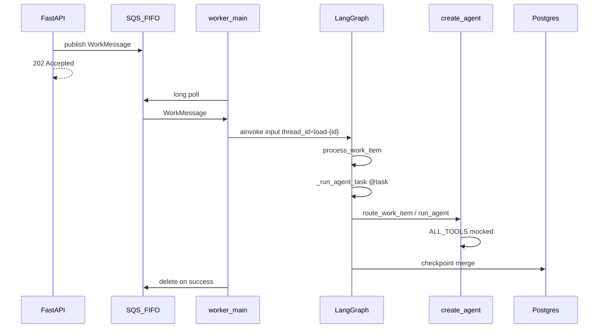
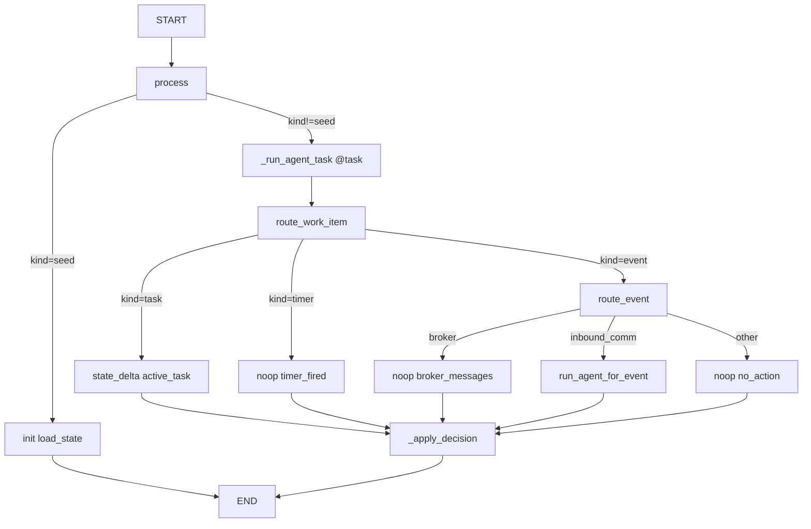
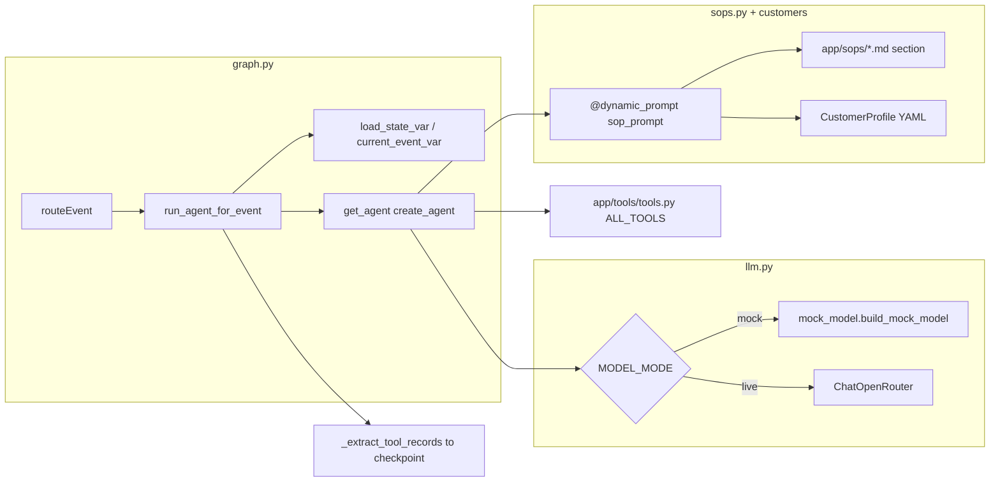

# Worker Module Guide

Context for agents working in `app/worker/`. This guide narrows the repo-level guidance in [`../../CLAUDE.md`](../../CLAUDE.md) to the SQS + LangGraph worker.

The worker long-polls SQS, processes one `WorkMessage` as one LangGraph step, and stores per-load state in PostgreSQL checkpoints. Run it with:

```bash
uv run python -m app.worker
```

Entrypoint flow: [`__main__.py`](__main__.py) calls [`main.py`](main.py), which opens the checkpointer, preloads customer profiles, and wires the SQS handler to [`process_work_message`](graph.py).

## Module Map

| File | Role |
| --- | --- |
| [`main.py`](main.py) | Bootstrap checkpointer, preload customer YAML, wire `on_message` to `process_work_message`. |
| [`checkpointer.py`](checkpointer.py) | Manage the `AsyncPostgresSaver` lifecycle and run checkpoint migrations once per process. |
| [`state.py`](state.py) | Define `LoadGraphState`; `tool_calls` uses an `operator.add` reducer for append-style accumulation. |
| [`graph.py`](graph.py) | Build the LangGraph graph, route work items, invoke `create_agent`, wrap side effects in `@task`, and expose eval state reads. |
| [`llm.py`](llm.py) | Select the chat model: OpenRouter for live runs or the fixture mock model for `MODEL_MODE=mock`. |
| [`mock_model.py`](mock_model.py) | Deterministic fixture LLM that emits tool calls from keyword and customer-profile rules. |
| [`sops.py`](sops.py) | Load branch-scoped SOP markdown sections from [`../sops/`](../sops/). |
| [`load_data.py`](load_data.py) | Detect requested load fields and format load data for tools and the mock model. |

Related modules this worker depends on:

| Module | Relationship |
| --- | --- |
| [`../queue/consumer.py`](../queue/consumer.py) | Transport-only SQS polling. It deserializes messages, calls the handler, and deletes messages after success. |
| [`../queue/messages.py`](../queue/messages.py) | Defines `WorkMessage` and dedup helpers for `seed`, `task`, `event`, and `timer` messages. |
| [`../tools/tools.py`](../tools/tools.py) | Mocked LangChain `@tool` primitives used by the agent. |
| [`../tools/context.py`](../tools/context.py) | `ContextVar` bridge for load/event state that should not appear in tool schemas. |
| [`../customers/base.py`](../customers/base.py) | Customer YAML access through `CustomerProfile`; do not add `if customer_id == ...` branches here. |

Keep the layer boundary intact: `app/queue/` is transport-only, while graph invocation, routing, agents, and checkpoint logic belong in `app/worker/`. See [`../../.cursor/rules/layer-boundaries.mdc`](../../.cursor/rules/layer-boundaries.mdc).

## End-To-End Flow



Key details:

- One SQS message becomes one `graph.ainvoke` in [`process_work_message`](graph.py).
- Every load uses `thread_id = load-{load_id}` via `graph_config`.
- `durability="sync"` is intentional so checkpoint writes complete before the SQS message is acknowledged.
- The API never invokes this graph directly; successful write endpoints publish to SQS and return `202`.

## LangGraph Routing Flow



`seed` initializes `load_state` and returns without invoking the agent. `task` currently sets `active_task`, `timer` records a noop branch, broker messages short-circuit before the LLM, and supported inbound communications enter the agent path.

## Agent Stack



`run_agent_for_event` sets context variables before building the agent. The dynamic prompt reads load state, the current event, customer profile settings, and a branch-specific SOP section. `llm.py` chooses a live OpenRouter model or the deterministic mock. Tool calls are recovered from `AIMessage` and `ToolMessage` pairs and appended to checkpoint state.

## Checkpoint State

`LoadGraphState` is the durable per-load graph state. Keep it small and intentional because evals and future agent branches depend on it.

| Field | Meaning |
| --- | --- |
| `load_state` | Domain snapshot: `customer_id`, `milestone`, `load_data`, and `active_task`. |
| `tool_calls` | Append-only list of `ToolCallRecord` dictionaries; this is the challenge eval trajectory contract. |
| `active_timers` | Timer metadata from timer-related tools and branches. |
| `session` | Reserved for conversational/session state; currently lightly used. |
| `kind`, `payload` | Per-invoke inputs to the graph. Treat them as the current message, not durable domain state. |

Tests and evals read checkpoints through [`query_load_state`](graph.py), including [`../../evals/run_evals.py`](../../evals/run_evals.py). There is deliberately no HTTP read API because the challenge contract only requires write endpoints.

## Challenge Workarounds And Intentional Gaps

| Topic | What we do | Why for the challenge |
| --- | --- | --- |
| Decoupled API | API routes only publish SQS work; the worker is the only graph caller. | The rubric expects async processing and `202 Accepted` write APIs. |
| Mocked tools | Side-effect tools return `{ok: true, ...}` plus synthetic IDs. | The take-home should not need Twilio, Slack, email, or TMS credentials. |
| `MODEL_MODE=mock` | `MockToolCallingModel` emits deterministic tool calls from keyword rules. | CI and fixture evals must run without OpenRouter and without model nondeterminism. |
| Context vars | `load_state_var` and `current_event_var` pass hidden state to tools and the mock. | LangChain tool schemas should stay simple and match challenge-facing tool inputs. |
| Broker guard | Broker inbound communications short-circuit before the agent. | This is a locked design decision; the event is still accepted by the API. |
| Tool call recording | `_extract_tool_records` parses model/tool messages and stores records in `tool_calls`. | Evals assert the trajectory from Postgres state, not only from LangSmith traces. |
| SOP prompt slice | The prompt injects the `load_information_question` section today. | The current implementation is a Phase 3 slice; the full SOP files remain in [`../sops/`](../sops/). |
| Narrow event routing | Unsupported event types return `noop` with `sop_branch=no_action`. | Phase 4+ fixtures are still pending. |
| Timer branch | `kind=timer` returns `noop` with `sop_branch=timer_fired`. | ETA follow-up agent behavior has not been implemented yet. |
| Task branch | `kind=task` only sets `active_task`. | Task submission activates the workflow but does not yet trigger a separate agent decision. |
| SQS timer cap | Timer scheduling uses delayed SQS messages. | SQS delay tops out at 900 seconds; production should use EventBridge for longer delays. |
| Graph per message | `process_work_message` builds the compiled graph for each message. | This keeps the take-home simple and is acceptable at this scale. |
| No read API | `query_load_state` is for tests/evals only. | The challenge exposes write endpoints; evals inspect checkpoints directly. |

When adding a new fixture branch, update the relevant routing code, `mock_model.py`, tools if needed, and eval fixtures together. The live prompt/agent path and mock path are parallel behavior surfaces; keep them aligned.

## Environment And Local Runs

See [`../../docs/DEPLOYMENT.md`](../../docs/DEPLOYMENT.md) for full local and cloud deployment notes.

Minimum local dependencies:

- PostgreSQL for LangGraph checkpoints.
- ElasticMQ or SQS for FIFO work items.
- `.env` values for `DATABASE_URL`, `SQS_QUEUE_URL`, and `MODEL_MODE`.
- `MODEL_MODE=mock` for evals; `MODEL_MODE=live` plus `OPENROUTER_API_KEY` for live LLM runs.

Useful commands:

```bash
uv run python -m app.worker
uv run pytest
uv run python evals/run_evals.py
```

The eval harness expects the API, worker, Postgres, and SQS/ElasticMQ to be running.

## Testing Pointers

Look at [`../../tests/test_graph.py`](../../tests/test_graph.py) for focused graph coverage: seed state, broker noop behavior, and mock-model tool calls read through `query_load_state`.

For higher-level workflow expectations, use [`../../docs/ARCHITECTURE.md`](../../docs/ARCHITECTURE.md), [`../../docs/research/implementation-spec.md`](../../docs/research/implementation-spec.md), and the challenge files under [`../../challenge-specs/`](../../challenge-specs/).

## Keep In Sync

Update this file when changing routing branches, checkpoint fields, mock-model branches, SOP prompt selection, or worker layer boundaries. If a change affects system-wide decisions, also update [`../../CLAUDE.md`](../../CLAUDE.md).
