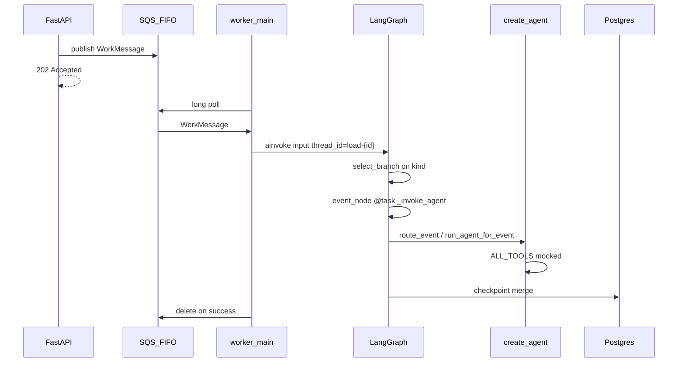
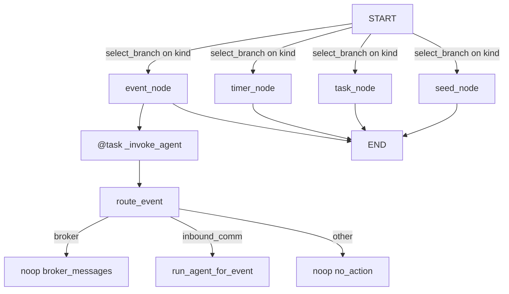
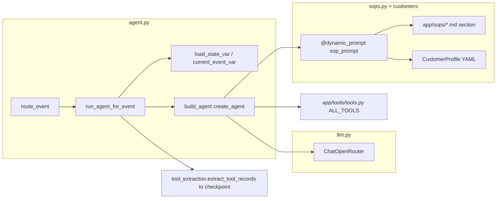

# Worker Module Guide

Context for agents working in `app/worker/`. This guide narrows the repo-level guidance in [`../../CLAUDE.md`](../../CLAUDE.md) to the SQS + LangGraph worker.

The worker long-polls SQS, processes one `WorkMessage` as one LangGraph step, and stores per-load state in PostgreSQL checkpoints. Run it with:

```bash
uv run python -m app.worker
```

Entrypoint flow: [`__main__.py`](__main__.py) calls [`main.py`](main.py), which opens the checkpointer, preloads customer profiles, and wires the SQS handler to [`process_work_message`](graph.py).

## Module Map

| File | Role |
| --- | --- |
| [`main.py`](main.py) | Bootstrap checkpointer, preload customer YAML, wire `on_message` to `process_work_message`. |
| [`checkpointer.py`](checkpointer.py) | Manage the `AsyncPostgresSaver` lifecycle and run checkpoint migrations once per process. |
| [`state.py`](state.py) | Define `LoadGraphState`; `tool_calls` uses an `operator.add` reducer for append-style accumulation. |
| [`graph.py`](graph.py) | Compile the `StateGraph`, wire conditional edges from START, and expose the public surface (`process_work_message`, `query_load_state`, `route_event` re-export, addressing helpers). |
| [`nodes.py`](nodes.py) | One node per work `kind` (`seed`, `task`, `timer`, `event`) plus `select_branch` used by the conditional edge from START. The `event` node wraps the agent invocation in `@task`. |
| [`agent.py`](agent.py) | `build_agent` (`create_agent` factory), `sop_prompt` dynamic prompt, `WatchtowerAgentState`, `run_agent_for_event`, and the `route_event` broker guard. |
| [`tool_extraction.py`](tool_extraction.py) | Pure `extract_tool_records` — pairs `AIMessage.tool_calls` with their `ToolMessage` results into `ToolCallRecord`s. |
| [`merge.py`](merge.py) | Pure helpers: `init_load_state` and `merge_load_data` (top-level merge, one level deep into `load_data`). |
| [`llm.py`](llm.py) | Build the `ChatOpenRouter` chat model for `create_agent`. Tests monkeypatch `get_chat_model`. |
| [`sops.py`](sops.py) | Load branch-scoped SOP markdown sections from [`../sops/`](../sops/). |
| [`load_data.py`](load_data.py) | Detect requested load fields and format load data for tools. |

Related modules this worker depends on:

| Module | Relationship |
| --- | --- |
| [`../queue/consumer.py`](../queue/consumer.py) | Transport-only SQS polling. It deserializes messages, calls the handler, and deletes messages after success. |
| [`../queue/messages.py`](../queue/messages.py) | Defines `WorkMessage` and dedup helpers for `seed`, `task`, `event`, and `timer` messages. |
| [`../tools/tools.py`](../tools/tools.py) | Mocked LangChain `@tool` primitives used by the agent. |
| [`../tools/context.py`](../tools/context.py) | `ContextVar` bridge for load/event state that should not appear in tool schemas. |
| [`../customers/base.py`](../customers/base.py) | Customer YAML access through `CustomerProfile`; do not add `if customer_id == ...` branches here. |

Keep the layer boundary intact: `app/queue/` is transport-only, while graph invocation, routing, agents, and checkpoint logic belong in `app/worker/`. See [`../../.cursor/rules/layer-boundaries.mdc`](../../.cursor/rules/layer-boundaries.mdc).

## End-To-End Flow



Key details:

- One SQS message becomes one `graph.ainvoke` in [`process_work_message`](graph.py).
- Every load uses `thread_id = load-{load_id}` via `graph_config`.
- `durability="sync"` is intentional so checkpoint writes complete before the SQS message is acknowledged.
- The API never invokes this graph directly; successful write endpoints publish to SQS and return `202`.

## LangGraph Routing Flow



The conditional edge from `START` (`select_branch`) dispatches on `state["kind"]`: `seed` initializes `load_state` and sets `active_task` from the seed's `milestone` via `sops.task_for_milestone`, `task` (from `POST /submit-task`) overrides `active_task` explicitly, `timer` is a noop placeholder for Phase 4+, and `event` invokes the agent through the durable `@task`-wrapped `_invoke_agent`. Inside `route_event`, broker messages short-circuit before the LLM and supported inbound communications enter `run_agent_for_event`.

## Agent Stack



`run_agent_for_event` sets context variables before building the agent (the dynamic prompt reads `load_state` / `current_event` straight from `request.state`; ContextVars stay so stateful tools can read load/event state without it appearing on tool schemas). The dynamic prompt emits XML-tagged sections (`<role>`, `<routing_rules>`, `<context>`, `<customer_profile>`, `<sop>`, `<load_state>`, `<incoming_event>`, `<examples>`, `<output_contract>`) and instructs the agent to return a JSON object parsed by `PydanticOutputParser` into `AgentResponse(summary, rationale)`. Tool calls are recovered from `AIMessage` / `ToolMessage` pairs by `tool_extraction.extract_tool_records` and appended to checkpoint state.

## Checkpoint State

`LoadGraphState` is the durable per-load graph state. Keep it small and intentional because evals and future agent branches depend on it.

| Field | Meaning |
| --- | --- |
| `load_state` | Domain snapshot: `customer_id`, `milestone`, `load_data`, and `active_task`. |
| `tool_calls` | Append-only list of `ToolCallRecord` dictionaries; this is the challenge eval trajectory contract. |
| `active_timers` | Timer metadata from timer-related tools and branches. |
| `session` | Reserved for conversational/session state; currently lightly used. |
| `kind`, `payload` | Per-invoke inputs to the graph. Treat them as the current message, not durable domain state. |

Tests and evals read checkpoints through [`query_load_state`](graph.py), including [`../../evals/run_evals.py`](../../evals/run_evals.py). There is deliberately no HTTP read API because the challenge contract only requires write endpoints.

## Challenge Workarounds And Intentional Gaps

| Topic | What we do | Why for the challenge |
| --- | --- | --- |
| Decoupled API | API routes only publish SQS work; the worker is the only graph caller. | The rubric expects async processing and `202 Accepted` write APIs. |
| Mocked tools | Side-effect tools return `{ok: true, ...}` plus synthetic IDs. | The take-home should not need Twilio, Slack, email, or TMS credentials. |
| Context vars | `load_state_var` and `current_event_var` pass hidden state to stateful tools. | LangChain tool schemas should stay simple and match challenge-facing tool inputs. |
| Broker guard | Broker inbound communications short-circuit before the agent. | This is a locked design decision; the event is still accepted by the API. |
| Tool call recording | `tool_extraction.extract_tool_records` parses model/tool messages and stores records in `tool_calls`. | Evals assert the trajectory from Postgres state, not only from LangSmith traces. |
| SOP prompt | The prompt is built section-by-section (`_role_block`, `_routing_rules_block`, `_context_block`, `_format_customer_profile`, `_sop_block`, `_load_state_block`, `_event_block`, `_examples_block`, `_output_contract_block` in `agent.py`) using XML-style tags around each section, with the customer profile rendered as a bullet list and the full active-task SOP markdown inside `<sop>...</sop>`. The agent must first call tools and then end with one plain-text message of the form `SUMMARY: ...` / `RATIONALE: ...`; `parse_final_answer` extracts both via regex from the last `AIMessage`. We deliberately do NOT bind `response_format=` to `create_agent` because that pulls models straight to the structured output and skips the tool loop. `active_task` must be set on `load_state` (no silent default) or prompt construction raises. | The agent picks the SOP section; Python no longer pre-selects one. |
| SOP selection | `task_for_milestone(milestone)` in `sops.py` maps `on_route_to_delivery → delivery_eta_checkpoint` and `at_delivery/delivered/pod_collected → confirm_delivery`. Applied in `seed_node`; overridable by `/submit-task`. | Fixtures choose the SOP via `initial_state` without needing a separate task submission. |
| Narrow event routing | Unsupported event types return `noop` with `sop=no_action`. | Phase 4+ fixtures are still pending. |
| Timer branch | `kind=timer` returns `noop` (no agent invocation). | ETA follow-up agent behavior has not been implemented yet. |
| Task branch | `kind=task` only sets `active_task`. | Task submission activates the workflow but does not yet trigger a separate agent decision. |
| SQS timer cap | Timer scheduling uses delayed SQS messages. | SQS delay tops out at 900 seconds; production should use EventBridge for longer delays. |
| Graph per message | `process_work_message` builds the compiled graph for each message. | This keeps the take-home simple and is acceptable at this scale. |
| No read API | `query_load_state` is for tests/evals only. | The challenge exposes write endpoints; evals inspect checkpoints directly. |

When adding a new fixture branch, update the relevant routing code, any new tools, and the eval fixtures together (and refresh the few-shot examples in `agent.py` if the new branch needs one). There is no mock LLM module — tests stub `get_chat_model` per-test.

## Error Handling Boundaries

| Layer | Behavior on failure |
| --- | --- |
| `consumer.py` | Poison messages (bad JSON / missing keys) are deleted from SQS; handler exceptions leave the message in flight so SQS redelivers and eventually DLQs after max-receive-count. |
| `process_work_message` | Logs `load_id`/`kind` on entry and on exception, then re-raises so the consumer can apply the retry/DLQ policy above. |
| `event_node` | If `load_state` is missing `customer_id` or `active_task` (event arrived before seed), records a noop `AgentDecision` instead of letting `build_system_prompt` raise. |
| `run_agent_for_event` | Any exception from `agent.ainvoke` or `extract_tool_records` is caught, logged, and converted into a noop `AgentDecision` with the error class + message in `reason`, so the checkpoint advances and the SQS message can be acked. |

## Environment And Local Runs

See [`../../docs/DEPLOYMENT.md`](../../docs/DEPLOYMENT.md) for full local and cloud deployment notes.

Minimum local dependencies:

- PostgreSQL for LangGraph checkpoints.
- ElasticMQ or SQS for FIFO work items.
- `.env` values for `DATABASE_URL`, `SQS_QUEUE_URL`, and `OPENROUTER_API_KEY`.

Useful commands:

```bash
uv run python -m app.worker
uv run pytest
uv run python evals/run_evals.py
```

The eval harness expects the API, worker, Postgres, and SQS/ElasticMQ to be running.

## Testing Pointers

Look at [`../../tests/test_graph.py`](../../tests/test_graph.py) for focused graph coverage: it monkeypatches `app.worker.llm.get_chat_model` with `tests/_llm_stub.ScriptedChatModel` to exercise the seed and event flow and reads results through `query_load_state`.

For higher-level workflow expectations, use [`../../docs/ARCHITECTURE.md`](../../docs/ARCHITECTURE.md), [`../../docs/research/implementation-spec.md`](../../docs/research/implementation-spec.md), and the challenge files under [`../../challenge-specs/`](../../challenge-specs/).

## Keep In Sync

Update this file when changing routing branches, checkpoint fields, SOP prompt structure, the plain-text final-answer contract (currently `SUMMARY:` / `RATIONALE:` parsed by `parse_final_answer`), or worker layer boundaries. If a change affects system-wide decisions, also update [`../../CLAUDE.md`](../../CLAUDE.md).
