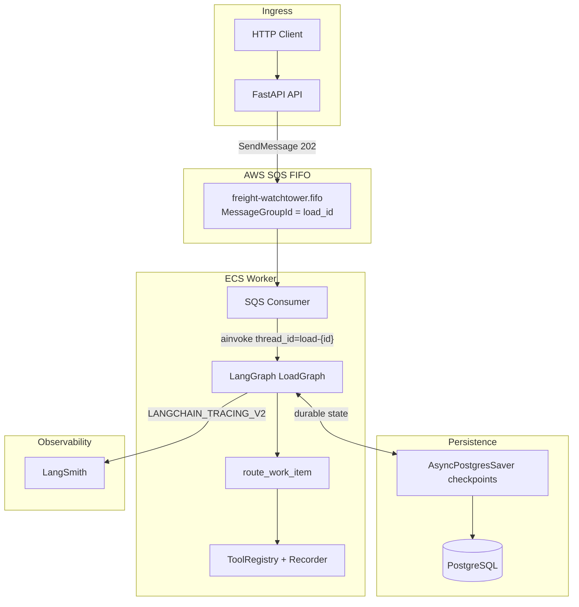

# FreightHero Watchtower — Implementation Spec

Consolidated build plan for the [AI Engineer Technical Challenge](../../challenge-specs/README.md). This document is the single source of truth for execution. (Historical Temporal notes: [use-temporal.md](./use-temporal.md) — superseded.)

**Execution path**

1. Setup repos and IaC
2. Setup agent harness (backlog, architecture docs, rules)
3. Plan and implement first feature

---

## 1. Goal and Success Criteria

### 1.1 What we are building

A small, production-shaped AI operator for two freight workflows:

| Workflow | SOP source | Task type |
| --- | --- | --- |
| On Route to Delivery / ETA Checkpoint | `challenge-specs/assets/sops/on_route_to_delivery_eta_checkpoint.md` | `delivery_eta_checkpoint` |
| Confirm Delivery | `challenge-specs/assets/sops/confirm_delivery.md` | `confirm_delivery` |

The system receives load events, tracking pings, inbound communications, and scheduled follow-ups; applies SOP-driven agent logic with customer-specific rules; and records every mocked tool call for evaluation.

### 1.2 Challenge deliverables (must ship)

| Deliverable | How we satisfy it |
| --- | --- |
| Public API (5 write endpoints) | FastAPI shim → SQS FIFO publish (`202`) |
| API decoupled from agent execution | SQS FIFO + LangGraph worker |
| Persistent per-load state | **PostgreSQL** — LangGraph checkpoints |
| Per-load concurrency safety | SQS `MessageGroupId=load_id` + `thread_id=load-{load_id}` |
| Customer A/B/C behavior | Declarative YAML profiles, no scattered `if customer` |
| Mocked tools + durable records | Tool registry; `tool_calls[]` in checkpoint state |
| Timers (not task types) | Delayed SQS messages (`kind=timer`); cancel via state + registry tools |
| Model fallback | Primary → fallback → mock (env-selectable for evals) |
| Containerized | One Docker image, two ECS commands (API + Worker) |
| IaC + real cloud | Terraform: `hashicorp/aws` (RDS, SQS, ECS) |
| Local run + evals | `docker-compose`, `make eval`, `EVAL_REPORT.md` |
| Observability | Structured logs + **LangSmith** for LLM/agent traces |
| Architecture write-up | `docs/ARCHITECTURE.md` |
| AI disclosure | `AI_USAGE.md` |

### 1.3 Rubric alignment (high level)

| Rubric area | Spec response |
| --- | --- |
| Production architecture | Thin API, SQS + LangGraph, declarative customers |
| SOP / agent behavior | SOP prompt + LangChain `create_agent` in `@task` |
| Evals | Fixture-driven harness, required/forbidden tool assertions |
| Deployment / security | ECS Fargate, Secrets Manager, no secrets in repo |
| Observability | Logs tie request → SQS → graph step → tool calls; LangSmith for live LLM |
| Engineering judgment | One-week scope; explicit gaps and intentional omissions |

---

## 2. Architecture Decision

### 2.1 Chosen stack

| Concern | Choice |
| --- | --- |
| Language / API | Python 3.12 + FastAPI |
| Python packaging | **[uv](https://docs.astral.sh/uv/)** — lockfile, venv, `uv run`, Docker installs |
| Queue / API decoupling | **AWS SQS FIFO** (`MessageGroupId = load_id`) |
| Agent orchestration | **LangGraph** with [durable execution](https://docs.langchain.com/oss/python/langgraph/durable-execution) (`@task`) |
| Persistence | **PostgreSQL** — [`AsyncPostgresSaver`](https://reference.langchain.com/python/langgraph/checkpoints) |
| LLM provider | **[ChatOpenRouter](https://reference.langchain.com/python/langchain-openrouter/chat_models/ChatOpenRouter)** via `langchain-openrouter` (§2.9) |
| Compute | AWS ECS Fargate (API behind ALB, agent worker egress-only) |
| IaC | Terraform (`hashicorp/aws`) |
| Local dev | `docker compose` — Postgres + ElasticMQ + API + worker |
| AI tracing | **LangSmith** (`LANGCHAIN_TRACING_V2`) |

### 2.2 Why LangGraph + SQS + Postgres

| Concern | Approach |
| --- | --- |
| API decoupled from agent | API publishes to SQS; worker invokes graph |
| Per-load serialization | FIFO `MessageGroupId` + checkpoint `thread_id=load-{load_id}` |
| Timers / follow-ups | `create_timer` → delayed SQS message (`kind=timer`) |
| Retries | SQS visibility timeout + DLQ |
| Crash recovery | LangGraph checkpoints + durable `@task` replay |

One graph step per SQS message; state accumulates in Postgres checkpoints.

### 2.3 Request flow



**Persistence split:** PostgreSQL checkpoints hold per-load operational state (`load_state`, `tool_calls`, `active_timers`). LangSmith (optional) holds AI audit data for live runs. Evals assert against `graph.aget_state` — no read HTTP API.

### 2.4 API → SQS mapping

| Endpoint | SQS work item |
| --- | --- |
| `POST /loads` | `{kind: "seed", load_id, payload: seed}` |
| `POST /submit-task` | `{kind: "task", load_id, payload: task}` |
| `POST /events/inbound-communication` | `{kind: "event", load_id, payload: event}` |
| `POST /events/tracking` | `{kind: "event", ...}` |
| `POST /events/load-update` | `{kind: "event", ...}` |

FIFO `MessageGroupId=load_id` serializes messages per load. `MessageDeduplicationId` from `event_id` / `task_uuid` / seed uuid makes duplicate POSTs idempotent. API returns `202` with `{accepted, load_id, workflow_id}` where `workflow_id` is `load-{load_id}` (LangGraph `thread_id`).

### 2.5 Graph state and processing model

**One SQS message = one graph step.** The worker calls `graph.ainvoke(input, config)` with `configurable.thread_id = f"load-{load_id}"`, then acks the message after a successful invoke.

Checkpointed fields (`app/worker/state.py`):

| Field | Purpose |
| --- | --- |
| `load_state` | `milestone`, `load_data`, `customer_id`, `active_task` |
| `session` | Short-term context for follow-ups |
| `tool_calls` | Tool records from the latest step (eval assertions) |
| `active_timers` | Timer metadata; `create_timer` also schedules delayed SQS |

`kind=seed` initializes `load_state` from the load payload; other kinds run the agent orchestrator (`create_agent` for events).

### 2.6 Agent processing (inside `@task`)

Side effects run in `_run_agent_task` (`@task` in `app/worker/graph.py`), which calls `route_work_item`:

```
broker_guard → create_agent (ReAct loop) → extract tool_calls → persist_state
```

1. Short-circuit broker senders (no-op, log reason).
2. Build SOP system prompt from customer YAML + active task + event.
3. Invoke LangChain `create_agent` with `ChatOpenRouter`.
4. Agent selects and executes tools via LangChain tool-calling loop.
5. Extract `ToolCallRecord`s from message history; merge `state_delta` into checkpoint; schedule timer SQS when needed.

### 2.7 Customer-specific behavior

Declarative YAML per customer (`app/customers/customer_*.yaml`):

- Escalation channel (email / slack / both)
- Geofence radius (miles)
- ETA follow-up timer (minutes)
- POD policy (auto vs human review)
- Visibility rules (notify on POD, delivered-without-POD, missing info)
- Lumper handling (forward email vs review task)
- First-arrival message template key

SOP markdown files are prompt templates with `{{slots}}` filled from customer config. **No** `if customer_id == "customer_b"` in application code.

Reference matrix: [customer-expectations.md](../../challenge-specs/assets/customer-expectations.md).

### 2.8 Observability

| Layer | Surface | What to capture |
| --- | --- | --- |
| API + ops | Structured JSON logs | `load_id`, `event_id`, endpoint, `202`, `workflow_id` |
| Orchestration | Postgres checkpoints + SQS metrics | per-load state, DLQ depth |
| AI / agent | **LangSmith** (optional) | LLM spans when `LANGCHAIN_TRACING_V2=true` |

Structured logs answer *"Why did the agent call these tools?"* LangSmith traces (live mode) answer *"What did the model see and decide?"*

**LangSmith** (optional — env vars only)

- Set `LANGCHAIN_TRACING_V2`, `LANGCHAIN_API_KEY`, `LANGCHAIN_PROJECT` for live runs.
- Default off in unit tests (the chat-model seam is stubbed; LangSmith is optional).
- LangChain auto-instruments agent calls when tracing is enabled.

### 2.9 LLM provider — OpenRouter via ChatOpenRouter

Live agent decisions use **[ChatOpenRouter](https://reference.langchain.com/python/langchain-openrouter/chat_models/ChatOpenRouter)** (`langchain-openrouter`) in `app/worker/llm.py`.

| Concern | Choice |
| --- | --- |
| Auth | `OPENROUTER_API_KEY` in `.env` / Secrets Manager |
| Primary model | `OPENROUTER_MODEL_PRIMARY` |
| Fallback model | `OPENROUTER_MODEL_FALLBACK` |
| Tests | `app.worker.llm.get_chat_model` is monkeypatched per-test with a scripted chat model |
| Live runs | Primary → fallback on retriable errors |
| Tracing | LangSmith auto-instruments LangChain calls when tracing enabled |

**Model fallback chain**

```text
OPENROUTER_MODEL_PRIMARY → OPENROUTER_MODEL_FALLBACK → fail
```

**Environment** (`.env.example` + `infra/app-secrets.json`)

```text
OPENROUTER_API_KEY=sk-or-...
OPENROUTER_MODEL_PRIMARY=anthropic/claude-sonnet-4
OPENROUTER_MODEL_FALLBACK=openai/gpt-4o-mini
LANGCHAIN_TRACING_V2=false
# LANGCHAIN_API_KEY=lsv2_...
# LANGCHAIN_PROJECT=freight-watchtower
```

---

## 3. Phase 1 — Setup Repos and IaC

**Goal:** Runnable local stack + Terraform skeleton + deployable container image. No agent logic yet beyond health checks.

### 3.1 Repository bootstrap

**Repo name:** `freighthero-watchtower` (or monorepo subfolder if preferred).

```
freighthero-watchtower/
├── README.md
├── AI_USAGE.md
├── Makefile
├── docker-compose.yml
├── Dockerfile
├── pyproject.toml              # uv-managed project metadata + deps
├── uv.lock                     # committed lockfile (uv lock)
├── .python-version             # pin 3.12 (uv python pin 3.12)
├── .env.example
├── .gitignore
│
├── app/
│   ├── api/
│   │   ├── main.py
│   │   ├── routes.py           # SQS publish only
│   │   └── schemas.py
│   ├── worker/                 # SQS consumer + LangGraph + create_agent
│   │   ├── __main__.py         # python -m app.worker
│   │   ├── main.py             # bootstrap
│   │   ├── graph.py            # LangGraph per-load processor
│   │   ├── state.py
│   │   ├── checkpointer.py
│   │   ├── agent.py            # create_agent factory
│   │   ├── router.py           # guards + route_work_item
│   │   ├── llm.py              # ChatOpenRouter factory
│   │   ├── load_data.py
│   │   └── sops.py
│   ├── queue/
│   │   ├── messages.py
│   │   ├── publisher.py
│   │   └── consumer.py
│   ├── tools/
│   │   ├── registry.py
│   │   └── recorder.py
│   ├── customers/
│   ├── sops/
│   └── observability/
│       └── logging.py
│
├── evals/
│   ├── run_evals.py
│   ├── assertions.py
│   ├── fixtures/               # symlink or copy test-cases.json
│   └── EVAL_REPORT.md
│
├── infra/
│   ├── main.tf
│   ├── variables.tf
│   ├── outputs.tf
│   ├── aws_rds.tf
│   ├── aws_sqs.tf
│   ├── aws_ecs.tf
│   ├── aws_ecr.tf
│   ├── aws_secrets.tf
│   └── README.md
│
└── docs/
    ├── ARCHITECTURE.md
    ├── BACKLOG.md
    └── DEPLOYMENT.md
```

### 3.1.1 Python project setup (uv)

Use **uv** for all Python dependency and interpreter management. Do not use `pip install` directly or commit a hand-edited `requirements.txt`.

**Bootstrap (once per machine)**

```bash
# Install uv: https://docs.astral.sh/uv/getting-started/installation/
uv python pin 3.12
uv init --app          # if starting empty; otherwise use existing pyproject.toml
uv add fastapi uvicorn langgraph langgraph-checkpoint-postgres langchain langchain-openrouter langsmith boto3 pydantic pytest pytest-asyncio
uv add --dev ruff mypy # optional
uv lock
uv sync
```

**Day-to-day commands**

| Command | Purpose |
| --- | --- |
| `uv sync` | Install deps from `uv.lock` into `.venv` |
| `uv add <pkg>` | Add dependency and update lockfile |
| `uv run uvicorn app.api.main:app --reload` | Run API locally |
| `uv run python -m app.worker` | Run SQS + LangGraph worker |
| `uv run pytest` | Unit tests |
| `uv run python evals/run_evals.py` | Eval harness |

**Makefile** (thin wrappers for reviewers):

```makefile
install: uv sync
dev-api: uv run uvicorn app.api.main:app --reload --port 8000
dev-worker: uv run python -m app.worker
test: uv run pytest
eval: uv run python evals/run_evals.py
```

Commit **`uv.lock`** and **`.python-version`**. CI and Docker builds use `uv sync --frozen`.

### 3.2 Local development

| Command | Purpose |
| --- | --- |
| `uv sync` | Create/update `.venv` from lockfile |
| `make dev-api` / `make dev-worker` | Run services via uv |
| `docker compose up` | Postgres + ElasticMQ + API + worker |
| `make test` | `uv run pytest` |
| `make eval` | Run fixture harness |

`docker-compose.yml` services:

- `postgresql` — LangGraph checkpoints (`watchtower` DB)
- `elasticmq` — local SQS FIFO
- `api` — FastAPI ingress
- `worker` — `python -m app.worker`

### 3.3 Dockerfile

Single image, dependencies installed with uv (reproducible from `uv.lock`):

```dockerfile
FROM ghcr.io/astral-sh/uv:python3.12-bookworm-slim AS builder
WORKDIR /app
COPY pyproject.toml uv.lock ./
RUN uv sync --frozen --no-dev --no-install-project
COPY . .
RUN uv sync --frozen --no-dev

FROM python:3.12-slim-bookworm
WORKDIR /app
COPY --from=builder /app /app
ENV PATH="/app/.venv/bin:$PATH"
# CMD overridden per ECS service:
# API:   uvicorn app.api.main:app --host 0.0.0.0 --port 8000
# Worker: python -m app.worker
```

### 3.4 Persistence model

| Data | Where it lives | How evals/reviewers access it |
| --- | --- | --- |
| Load seed, milestone, `load_data` | Postgres checkpoint `load_state` | `graph.aget_state(thread_id=load-{id})` |
| Tool calls (challenge contract) | Checkpoint `tool_calls[]` | Eval harness `query_load_state` |
| Timers | `active_timers` + delayed SQS messages | State + queue inspection |
| LLM audit (live) | LangSmith | LangSmith UI when tracing enabled |

`app/tools/recorder.py` appends tool-call records returned in graph state for eval assertions.

### 3.5 Terraform (IaC)

**Providers**

- `hashicorp/aws` — RDS, SQS, ECS, ECR, ALB, Secrets Manager, IAM

**AWS resources**

| Resource | Notes |
| --- | --- |
| RDS Postgres | LangGraph checkpoints (`aws_rds.tf`) |
| SQS FIFO + DLQ | Work queue (`aws_sqs.tf`) |
| ECR repository | Container image |
| ECS cluster | Fargate — API + worker services |
| ALB + target group | Public API base URL |
| Secrets Manager | `DATABASE_URL`, `SQS_QUEUE_URL`, `OPENROUTER_API_KEY`, `LANGCHAIN_API_KEY` |

**Secrets (never commit)**

- `DATABASE_URL`, `SQS_QUEUE_URL`, `AWS_REGION`
- `OPENROUTER_API_KEY` (and optional `OPENROUTER_MODEL_*`)
- `LANGCHAIN_API_KEY` (optional, live tracing)

**Phase 1 exit criteria**

- [x] Repo scaffold with README local-run section
- [x] `pyproject.toml`, `uv.lock`, `.python-version` committed
- [x] `docker compose up` starts Postgres + ElasticMQ + API + worker
- [x] `GET /health` responds
- [x] Terraform plan: RDS + SQS + ECS skeleton
- [x] `.env.example` documents required variables

---

## 4. Phase 2 — Setup Agent Harness

**Goal:** Everything needed to implement SOP branches quickly—before broad feature work.

### 4.1 Documentation

| Doc | Contents |
| --- | --- |
| `docs/ARCHITECTURE.md` | Diagrams, SQS/LangGraph mapping, tradeoffs, customer-config approach, omissions |
| `docs/DEPLOYMENT.md` | Cloud resources, secrets, least-privilege, how to capture deploy evidence |
| `docs/BACKLOG.md` | Prioritized feature list (see §6 Behavior roadmap) |

### 4.2 Cursor / project rules

Add `.cursor/rules/` (or `CLAUDE.md`) covering:

- Durable execution: router + tools inside LangGraph `@task`; API publishes to SQS only
- Customer config: always read YAML profile, never hardcode customer branches
- Tool calls: always record via `recorder.py`
- Broker messages: always no-op
- Evals: every new branch needs a fixture assertion update
- Commit style and test-before-merge for agent changes

### 4.3 Input validation

Translate [challenge-input.schema.json](../../challenge-specs/assets/schemas/challenge-input.schema.json) to Pydantic models in `app/api/schemas.py`. Validate all five public endpoints.

### 4.4 Tool registry and recorder

Implement all tools from [tools.md](../../challenge-specs/assets/tools.md):

| Category | Tools |
| --- | --- |
| Communication | `send_sms`, `send_email`, `forward_email`, `send_slack_message` |
| Attachments | `check_attachment` |
| State | `update_load_state`, `update_eta` |
| Timers | `create_timer`, `cancel_timer`, `cancel_timers` |
| Human work | `create_task`, `create_issue` |
| Helpers | `get_load_info`, `validate_eta`, `get_appointment_time` |

Recorder shape:

```json
{
  "tool_call_id": "uuid",
  "event_id": "evt-xxx",
  "load_id": "load-xxx",
  "tool": "send_sms",
  "arguments": {},
  "result": {},
  "created_at": "ISO-8601"
}
```

### 4.5 Customer YAML profiles

Map [customer-expectations.md](../../challenge-specs/assets/customer-expectations.md) into three files. Example fields:

```yaml
customer_id: customer_a
escalation:
  channels: [email]
geofence_radius_miles: 1
eta_followup_minutes: 30
pod:
  validation: automatic
  notify_on_received: true
  notify_delivered_without_pod: true
missing_load_info:
  create_task: true
  notify: false
lumper:
  mode: review_task
first_arrival_message_key: ask_unloading_and_pod
```

### 4.6 Eval harness

| Component | Responsibility |
| --- | --- |
| `evals/run_evals.py` | Single command: seed load → POST events → assert tool_calls + state |
| `evals/assertions.py` | `required_tool_calls`, `forbidden_tool_calls`, `expected_state` |
| `evals/fixtures/test-cases.json` | Copy from challenge-specs |
| Timer tests | Inject `kind=timer` SQS messages or unit test with `MemorySaver` |

**Eval modes**

1. **Integration** — HTTP against local API + real worker
2. **Graph unit** — `MemorySaver` + direct invoke for timer/router branches

Command: `make eval` → writes/updates `evals/EVAL_REPORT.md`.

### 4.7 Model fallback wiring (OpenRouter)

- [x] `app/worker/llm.py` — `ChatOpenRouter` factory, primary/fallback
- [x] `app/config.py` — `OPENROUTER_*`, LangSmith vars
- [x] README documents OpenRouter as the only LLM path

### 4.8 LangSmith setup (agent harness)

- [ ] Set `LANGCHAIN_TRACING_V2` env vars for live runs; capture one trace URL in `docs/evidence/`

### 4.9 Phase 2 exit criteria

- [x] `docs/ARCHITECTURE.md` and `docs/BACKLOG.md` exist
- [x] Cursor rules committed (`.cursor/rules/watchtower.mdc`)
- [x] All tools registered; recorder updates checkpoint `tool_calls[]`
- [x] Customer YAML files match behavior matrix
- [x] Eval harness runs
- [x] SOP files under `app/sops/`

---

## 5. Phase 3 — First Feature

**Goal:** Smallest end-to-end vertical slice proving API → SQS → LangGraph → tool → eval.

### 5.1 Feature: ETA checkpoint — load information question (info found)

**Fixture:** `3b_load_question_found` in [test-cases.json](../../challenge-specs/assets/fixtures/test-cases.json)

**Scenario:** Driver SMS asks "What's the delivery address?" while `on_route_to_delivery`. Address exists in load data.

**Expected behavior (from SOP + fixture)**

1. Classify sender: driver, channel SMS → not broker.
2. Branch: ETA checkpoint → Load Information Question.
3. `get_load_info` (or read from state) for delivery address.
4. `send_sms` with address containing `456 Delivery St`.
5. State remains `on_route_to_delivery`.
6. No `create_task`, `create_issue`, email, or slack.

### 5.2 Implementation tasks (ordered)

| # | Task | Owner layer |
| --- | --- | --- |
| 1 | `POST /loads` enqueues seed work item | API + SQS |
| 2 | `POST /events/inbound-communication` enqueues event | API |
| 3 | Worker invokes graph with `kind=event` | Worker + Graph |
| 4 | Router: broker short-circuit (stub for later cases) | Router |
| 5 | Router: load-info question branch | Router |
| 6 | Tools: `get_load_info` + `send_sms` via registry | Tools |
| 7 | Recorder persists tool calls in checkpoint | Tools |
| 8 | `aget_state` returns milestone + tool_calls | Graph |
| 9 | Eval case `3b` passes | Evals |

### 5.3 Second increment (same feature family)

**Fixture:** `3c_load_question_missing` (Customer B)

- Missing `receiver_phone` → `send_sms` with "checking", `create_task` (missing_load_info), `send_slack_message` to broker audience.
- Validates customer YAML drives escalation differences.

### 5.4 First feature exit criteria

- [ ] `make eval` passes `3b_load_question_found`
- [ ] `3c_load_question_missing` passes (stretch in same PR or immediate follow-up)
- [ ] Structured logs show branch + tool calls for one manual run
- [ ] `EVAL_REPORT.md` updated with pass/fail and notes

### 5.5 API contract reference

Payload shapes must match [challenge-input.schema.json](../../challenge-specs/assets/schemas/challenge-input.schema.json). Event example for 3b:

```json
{
  "event_id": "evt-3b",
  "event_type": "inbound_communication",
  "load_id": "load-visible-001",
  "customer_id": "customer_a",
  "occurred_at": "2026-05-11T17:05:00Z",
  "inbound_communication": {
    "channel": "sms",
    "sender_type": "driver",
    "sender_name": "Sam Driver",
    "content": "What's the delivery address?",
    "attachments": []
  }
}
```

---

## 6. Behavior Roadmap (Post–First Feature)

Prioritized backlog after Phase 3. Each row should add eval coverage before moving on.

| Priority | Case ID | Branch | Key tools |
| --- | --- | --- | --- |
| P1 | `3b`, `3c` | Load info found / missing | `send_sms`, `create_task`, `send_slack_message` |
| P2 | `3k` | Broker ignore | none (forbidden all comms) |
| P3 | `3d` | Operational issue | `create_issue`, `send_sms` |
| P4 | `3f` | Driver provides ETA | `update_eta`, `send_sms`, `create_timer` |
| P5 | `3h` | Tracking geofence (3 pings) | `update_load_state`, `cancel_timers` |
| P6 | `3i` | Manual arrival | `update_load_state`, `send_sms`, `cancel_timers` |
| P7 | `3j` | POD attachment | `check_attachment`, `update_load_state`, `send_sms` |
| P8 | — | Confirm delivery branches | POD, lumper, unloading states |
| P9 | — | Customer C lumper forward | `forward_email` |
| P10 | — | Timer-fired follow-ups | delayed SQS `kind=timer` + cancel tools |

Hidden eval risks to document in `EVAL_REPORT.md`:

- Event ordering variations
- Ambiguous ETA text
- Mixed attachments (POD + lumper)
- Stale vs fresh tracking edge cases

---

## 7. Testing Strategy

### 7.1 Visible fixtures (minimum bar)

All cases in [test-cases.json](../../challenge-specs/assets/fixtures/test-cases.json):

| ID | Title | Customer |
| --- | --- | --- |
| `3b_load_question_found` | Delivery address question | A |
| `3c_load_question_missing` | Missing receiver phone | B |
| `3d_truck_broken` | Truck breakdown | A |
| `3f_driver_provides_eta` | Valid ETA | C |
| `3h_fresh_tracking_three_pings_in_geofence` | Geofence arrival | B |
| `3i_not_tracking_driver_says_arrived` | Manual arrival | A |
| `3j_not_tracking_driver_sends_pod` | POD attachment | C |
| `3k_broker_email_ignore` | Broker ignore | A |

### 7.2 Assertion types

```python
assert_tool_called(tool="send_sms", contains="456 Delivery St")
assert_tool_forbidden("create_task")
assert_state("on_route_to_delivery")
```

### 7.3 Timer tests

For ETA follow-up fixtures (`3f`), inject a delayed `kind=timer` SQS message in tests (or use `MemorySaver` unit tests in `tests/test_graph.py`). AWS production: SQS `DelaySeconds` max 900s; use EventBridge Scheduler for longer ETA windows.

---

## 8. Deployment and Evidence

### 8.1 Submission checklist

1. GitHub repo URL
2. Deployed public API base URL (ALB DNS)
3. Local run instructions (`README.md`)
4. Eval command (`make eval`)
5. Deployed run logs/traces (JSONL or cloud log export in `docs/evidence/`)
6. `docs/ARCHITECTURE.md`
7. `AI_USAGE.md`

### 8.2 Deploy evidence capture

After first cloud deploy, run one fixture manually against production and save:

- API access log line (load_id, event_id)
- SQS message processed + checkpoint snapshot
- **LangSmith trace URL** for one live agent run (optional)
- Structured log with tool calls
- `graph.aget_state` milestone + `tool_calls[]`

---

## 9. Risks, Fallbacks, and Intentional Omissions

### 9.1 Risks

| Risk | Mitigation |
| --- | --- |
| RDS / Postgres unavailable locally | `docker compose up postgresql`; run `checkpointer.setup()` on worker start |
| SQS 15 min max delay | EventBridge Scheduler → SQS for long ETA follow-ups in AWS |
| Checkpoint migration drift | Pin `langgraph-checkpoint-postgres`; call `setup()` on deploy |
| ECS/IaC time sink | Ship local-first; deploy after evals pass locally |
| LLM non-determinism in evals | Pin temperature low and accept some assertion tolerance; unit tests stub the chat-model seam |

### 9.2 Intentional omissions (one-week scope)

- Full confirm-delivery branch coverage (implement P8+ if time)
- Read APIs for load/event state (not required by challenge)
- Real SMS/email/Slack integrations
- OCR / real attachment processing
- Multi-region HA
- EventBridge timer scheduler (deferred; SQS delay capped at 900s)

Document all omissions in `docs/ARCHITECTURE.md` with "next steps if more time."

### 9.3 Cost assumptions

- AWS: minimal Fargate + ALB + small RDS (~tens of dollars for review period)
- LangSmith free tier sufficient for demo traces

---

## 10. Handoff — Next Implementation Steps

When moving from spec to code:

1. **Initialize repo** per §3.1: `uv sync`, LangGraph + SQS + Postgres stack.
2. **`docker compose up`** — Postgres, ElasticMQ, API, worker.
3. **Apply Terraform** for RDS + SQS + ECR; defer full ECS until local eval passes.
4. **Complete Phase 2 harness** (tools, customers, eval runner).
5. **Implement Phase 3** (`3b`, `3c`) — done; re-verify after stack changes.
6. **Deploy** and capture evidence per §8.
7. **Iterate roadmap** §6 by priority.

---

## Appendix A — Challenge Requirement Traceability

| Challenge requirement | Spec section |
| --- | --- |
| Python implementation | §2.1 |
| API/worker decoupled | §2.2, §2.4 |
| Persistent per-load state | §2.5, §3.4 |
| Per-load concurrency | §2.2 |
| SOP + customer behavior | §2.7 |
| Mocked recorded tools | §4.4 |
| Timers not task types | §2.2 |
| Model fallback | §2.9 (OpenRouter), §4.7 |
| 5 public endpoints | §2.4, §5 |
| Containerized | §3.3 |
| IaC + real cloud | §3.5, §8 |
| Eval harness + report | §4.6, §7 |
| Observability | §2.8 |
| AI_USAGE.md | §3.1, §8.1 |

## Appendix B — Research Document Mapping

| Topic | Source |
| --- | --- |
| Repo layout, SOP nodes, customer YAML | §3.1, §2.7 (this document) |
| Archived Temporal decision brief | [use-temporal.md](./use-temporal.md) (superseded) |
| Challenge rules, API, assets | [challenge-specs/README.md](../../challenge-specs/README.md) |
| Scoring expectations | [challenge-specs/assets/rubric.md](../../challenge-specs/assets/rubric.md) |

---

*Last updated: implementation spec v2.0 — LangGraph + SQS FIFO + PostgreSQL checkpoints; LangSmith tracing; ChatOpenRouter.*
