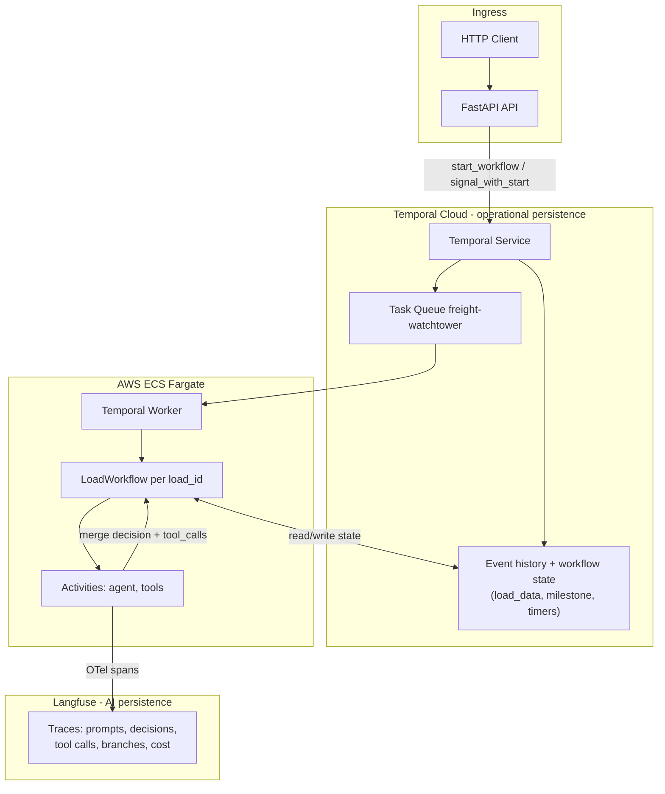

# FreightHero Watchtower — Implementation Spec

Consolidated build plan for the [AI Engineer Technical Challenge](../../challenge-specs/README.md). This document is the single source of truth for execution. It merges decisions from [initial-plan.md](./initial-plan.md) and [use-temporal.md](./use-temporal.md).

**Execution path**

1. Setup repos and IaC
2. Setup agent harness (backlog, architecture docs, rules)
3. Plan and implement first feature

---

## 1. Goal and Success Criteria

### 1.1 What we are building

A small, production-shaped AI operator for two freight workflows:

| Workflow | SOP source | Task type |
| --- | --- | --- |
| On Route to Delivery / ETA Checkpoint | `challenge-specs/assets/sops/on_route_to_delivery_eta_checkpoint.md` | `delivery_eta_checkpoint` |
| Confirm Delivery | `challenge-specs/assets/sops/confirm_delivery.md` | `confirm_delivery` |

The system receives load events, tracking pings, inbound communications, and scheduled follow-ups; applies SOP-driven agent logic with customer-specific rules; and records every mocked tool call for evaluation.

### 1.2 Challenge deliverables (must ship)

| Deliverable | How we satisfy it |
| --- | --- |
| Public API (5 write endpoints) | FastAPI shim → Temporal signal-with-start / workflow start |
| API decoupled from agent execution | Temporal Task Queue + per-load workflows |
| Persistent per-load state | **Temporal Cloud** — workflow fields + event history (replay-safe) |
| Per-load concurrency safety | `workflow_id = load-{load_id}` (Temporal singleton guarantee) |
| Customer A/B/C behavior | Declarative YAML profiles, no scattered `if customer` |
| Mocked tools + durable records | Tool registry; each call recorded as Langfuse span + workflow state delta |
| Timers (not task types) | Durable `asyncio.sleep` in workflow; cancel via workflow logic |
| Model fallback | Primary → fallback → mock (env-selectable for evals) |
| Containerized | One Docker image, two ECS commands (API + Worker) |
| IaC + real cloud | Terraform: `temporalio/temporalcloud` + `hashicorp/aws` |
| Local run + evals | `docker-compose`, `make eval`, `EVAL_REPORT.md` |
| Observability | Structured logs + Temporal Web UI + **Langfuse** for LLM/agent traces |
| Architecture write-up | `docs/ARCHITECTURE.md` |
| AI disclosure | `AI_USAGE.md` |

### 1.3 Rubric alignment (high level)

| Rubric area | Spec response |
| --- | --- |
| Production architecture | Thin API, Temporal orchestration, declarative customers |
| SOP / agent behavior | SOP prompt templates + branch router in activity |
| Evals | Fixture-driven harness, required/forbidden tool assertions |
| Deployment / security | ECS Fargate, Secrets Manager, no secrets in repo |
| Observability | Logs tie request → workflow → activity → tool calls |
| Engineering judgment | One-week scope; explicit gaps and intentional omissions |

---

## 2. Architecture Decision

### 2.1 Chosen stack

| Concern | Choice |
| --- | --- |
| Language / API | Python 3.12 + FastAPI |
| Python packaging | **[uv](https://docs.astral.sh/uv/)** — lockfile, venv, `uv run`, Docker installs |
| Durable async / queue / timers / per-load lock | **Temporal Cloud** + `temporalio` Python SDK |
| Agent decision (inside activities) | LLM call with SOP + customer config (LangGraph optional, not required for v1) |
| Persistence | **Temporal Cloud** (load/workflow state, events, timers) + **Langfuse** (LLM + tool-call audit) |
| Compute | AWS ECS Fargate (API behind ALB, Worker egress-only) |
| IaC | Terraform |
| Local dev | `temporal server start-dev` + docker-compose |
| AI tracing | **Langfuse** (OpenTelemetry + activity instrumentation) — [Temporal integration](https://langfuse.com/integrations/frameworks/temporal) |

### 2.2 Why Temporal supersedes the pgmq plan

The [initial-plan](./initial-plan.md) used Supabase Postgres + `pgmq` + advisory locks + a custom timer poller. The [Temporal brief](./use-temporal.md) shows Temporal Cloud replaces those concerns with fewer moving parts:

| Concern | pgmq plan | Temporal plan |
| --- | --- | --- |
| Queue between API and worker | `pgmq.send` / `read` | Task Queue in Temporal Cloud |
| Per-load serialization | `pg_advisory_xact_lock` | `workflow_id = load-{load_id}` |
| Timers / follow-ups | `timers` table + poller loop | `await asyncio.sleep(...)` in workflow |
| Retries | Hand-rolled on consumer | `RetryPolicy` on activities |
| Crash recovery | Visibility timeout + replay queue | Workflow event history replay |

**Net:** one managed control plane (Temporal Cloud) + one Python SDK instead of pgmq, poller, and lock code. Workers still run in our AWS account; Temporal never executes application code.

### 2.3 Request flow



**Persistence split:** Temporal Cloud is the source of truth for per-load operational state (milestone, `load_data`, pending events, timer handles, activity outcomes). Langfuse is the source of truth for AI audit data (prompts, model output, tool invocations, SOP branch, latency/cost). No separate application database is required for v1; evals assert against workflow queries and/or Langfuse trace exports.

### 2.4 API → Temporal mapping

| Endpoint | Temporal operation |
| --- | --- |
| `POST /loads` | `start_workflow(LoadWorkflow.run, load_id, id=load-{load_id}, ...)` with seed payload |
| `POST /submit-task` | Signal `on_task` or start workflow with task payload |
| `POST /events/inbound-communication` | **Signal-with-start** `on_event` with event payload |
| `POST /events/tracking` | Signal-with-start `on_event` |
| `POST /events/load-update` | Signal-with-start `on_event` |

Signal-with-start makes event endpoints idempotent: no "does workflow exist?" branch in API code.

```python
# API pattern (illustrative)
await client.start_workflow(
    LoadWorkflow.run,
    load_id,
    id=f"load-{load_id}",
    task_queue="freight-watchtower",
    id_conflict_policy=WorkflowIDConflictPolicy.USE_EXISTING,
    start_signal="on_event",
    start_signal_args=[event],
)
return Response(status_code=202)
```

### 2.5 LoadWorkflow shape

```python
@workflow.defn
class LoadWorkflow:
    def __init__(self):
        self.load_state: dict = {}      # milestone, load_data, customer_id
        self.session: dict = {}         # short-term context for follow-ups
        self.pending: asyncio.Queue = asyncio.Queue()
        self.active_timers: dict = {}   # timer_type -> handle metadata

    @workflow.signal
    async def on_event(self, event: dict): ...

    @workflow.signal
    async def on_task(self, task: dict): ...

    @workflow.query
    def get_state(self) -> dict: ...

    @workflow.run
    async def run(self, load_id: str, seed: dict | None = None):
        # Initialize from seed; loop: dequeue event → activity → apply decision
        ...
```

**Determinism rule:** no I/O, `datetime.now()`, or LLM calls inside `@workflow.defn` methods. All non-determinism lives in `@activity.defn` functions.

### 2.6 Agent activity (inside Temporal)

Each event triggers one activity run (not a multi-node LangGraph graph for v1):

```
classify_sender → select_sop_branch → gather_context → decide_actions → execute_tools → persist_state
```

Implemented as a single `run_agent_activity(state, event) -> AgentDecision` that:

1. Short-circuits broker senders (no-op, log reason).
2. Selects ETA vs Confirm Delivery branch from event + load milestone.
3. Loads customer profile YAML for `customer_id`.
4. Calls LLM with SOP prompt sections + state + event (or deterministic mock in eval mode).
5. Executes mocked tools via registry; records each call.
6. Returns state delta + tool call list for workflow to merge.

LangGraph may be added later via `temporalio.contrib.langgraph_plugin`; not required for the first feature slice.

### 2.7 Customer-specific behavior

Declarative YAML per customer (`app/customers/customer_*.yaml`):

- Escalation channel (email / slack / both)
- Geofence radius (miles)
- ETA follow-up timer (minutes)
- POD policy (auto vs human review)
- Visibility rules (notify on POD, delivered-without-POD, missing info)
- Lumper handling (forward email vs review task)
- First-arrival message template key

SOP markdown files are prompt templates with `{{slots}}` filled from customer config. **No** `if customer_id == "customer_b"` in application code.

Reference matrix: [customer-expectations.md](../../challenge-specs/assets/customer-expectations.md).

### 2.8 Observability

Three complementary surfaces (challenge rubric expects logs/traces connecting API → processing → tool calls):

| Layer | Surface | What to capture |
| --- | --- | --- |
| API + ops path | Structured JSON logs | `request_id`, `load_id`, `event_id`, endpoint, `202`, workflow_id |
| Orchestration | Temporal Web UI | workflow runs, signals, timers, activity retries |
| AI / agent | **Langfuse** | prompts, completions, model, latency, cost, tool calls, SOP branch, state delta |

Structured JSON logs must allow answering: *"Why did the agent call these tools for this event?"* Langfuse traces answer *"What did the model see and decide?"*

#### 2.8.1 Langfuse + Temporal

We use [Langfuse's Temporal integration pattern](https://langfuse.com/integrations/frameworks/temporal): emit OpenTelemetry spans from **activities** (never from workflow code — determinism). Langfuse ingests OTel and shows nested traces: workflow execution → `run_agent_activity` → LLM calls → tool executions.

**Principles**

- Instrument **activities only** (`run_agent_activity`, helper activities). Workflow code stays deterministic.
- Propagate correlation IDs into every Langfuse span: `load_id`, `event_id`, `customer_id`, `workflow_id`, `sop_branch`.
- Disable Langfuse export in CI when `MODEL_MODE=mock` (optional `LANGFUSE_ENABLED=false`).

**Dependencies** (add with `uv add`; listed in `pyproject.toml`)

```text
langfuse
opentelemetry-api
opentelemetry-sdk
opentelemetry-exporter-otlp-proto-http
# If using OpenAI SDK directly in activities:
openinference-instrumentation-openai
```

**Environment** (`.env.example` + Secrets Manager)

```text
LANGFUSE_PUBLIC_KEY=pk-lf-...
LANGFUSE_SECRET_KEY=sk-lf-...
LANGFUSE_BASE_URL=https://cloud.langfuse.com   # or https://us.cloud.langfuse.com
LANGFUSE_ENABLED=true
```

**Bootstrap** (`app/observability/langfuse.py`)

1. Configure OTel `TracerProvider` with OTLP HTTP exporter pointing at Langfuse's OTel endpoint (per [Langfuse OTel docs](https://langfuse.com/docs/opentelemetry/get-started)).
2. On worker startup, register instrumentors before activities run (e.g. `OpenAIInstrumentor().instrument()` if using OpenAI SDK).
3. Wrap `run_agent_activity` with Langfuse `@observe()` (or manual span) and set metadata: `load_id`, `event_id`, `sop_branch`, `customer_id`.

**Activity trace shape (target)**

```text
run_agent_activity
├── classify_sender
├── select_sop_branch
├── llm_decide          ← generation span (input messages, output, tokens)
└── execute_tools       ← child spans per tool name + arguments summary
```

**Submission evidence**

- Include at least one Langfuse trace URL (or exported JSON) from a deployed or local run in `docs/evidence/`.
- Cross-link `request_id` / `event_id` in structured logs to the Langfuse trace id in log fields.

**Local verification**

1. Start Temporal dev server + worker.
2. Post one fixture event (`3b_load_question_found`).
3. Confirm trace appears in Langfuse project with workflow/activity nesting and tool-call children.

### 2.9 Model fallback

```text
primary_model → fallback_model → mock_model (eval / CI)
```

- Env: `MODEL_MODE=live|mock`, `OPENAI_API_KEY`, etc.
- Mock returns deterministic decisions mapped to fixture expectations for CI.
- Langfuse traces live runs when `LANGFUSE_ENABLED=true` and `MODEL_MODE=live`.

---

## 3. Phase 1 — Setup Repos and IaC

**Goal:** Runnable local stack + Terraform skeleton + deployable container image. No agent logic yet beyond health checks.

### 3.1 Repository bootstrap

**Repo name:** `freighthero-watchtower` (or monorepo subfolder if preferred).

```
freighthero-watchtower/
├── README.md
├── AI_USAGE.md
├── Makefile
├── docker-compose.yml
├── Dockerfile
├── pyproject.toml              # uv-managed project metadata + deps
├── uv.lock                     # committed lockfile (uv lock)
├── .python-version             # pin 3.12 (uv python pin 3.12)
├── .env.example
├── .gitignore
│
├── app/
│   ├── api/
│   │   ├── main.py
│   │   ├── routes.py
│   │   └── schemas.py          # from challenge-input.schema.json
│   ├── workflows/
│   │   └── load_workflow.py
│   ├── activities/
│   │   ├── agent.py
│   │   └── persist.py
│   ├── tools/
│   │   ├── registry.py
│   │   └── recorder.py
│   ├── customers/
│   │   ├── base.py
│   │   ├── customer_a.yaml
│   │   ├── customer_b.yaml
│   │   └── customer_c.yaml
│   ├── sops/                   # copied/adapted from challenge-specs/assets/sops/
│   └── observability/
│       ├── logging.py
│       └── langfuse.py         # OTel exporter + @observe helpers
│
├── evals/
│   ├── run_evals.py
│   ├── assertions.py
│   ├── fixtures/               # symlink or copy test-cases.json
│   └── EVAL_REPORT.md
│
├── infra/
│   ├── main.tf
│   ├── variables.tf
│   ├── outputs.tf
│   ├── temporal.tf
│   ├── aws_ecs.tf
│   ├── aws_ecr.tf
│   ├── aws_secrets.tf
│   └── README.md
│
└── docs/
    ├── ARCHITECTURE.md
    ├── BACKLOG.md
    └── DEPLOYMENT.md
```

### 3.1.1 Python project setup (uv)

Use **uv** for all Python dependency and interpreter management. Do not use `pip install` directly or commit a hand-edited `requirements.txt`.

**Bootstrap (once per machine)**

```bash
# Install uv: https://docs.astral.sh/uv/getting-started/installation/
uv python pin 3.12
uv init --app          # if starting empty; otherwise use existing pyproject.toml
uv add fastapi uvicorn temporalio pydantic langfuse pytest pytest-asyncio
uv add --dev ruff mypy # optional
uv lock
uv sync
```

**Day-to-day commands**

| Command | Purpose |
| --- | --- |
| `uv sync` | Install deps from `uv.lock` into `.venv` |
| `uv add <pkg>` | Add dependency and update lockfile |
| `uv run uvicorn app.api.main:app --reload` | Run API locally |
| `uv run python -m app.worker` | Run Temporal worker |
| `uv run pytest` | Unit tests |
| `uv run python evals/run_evals.py` | Eval harness |

**Makefile** (thin wrappers for reviewers):

```makefile
install: uv sync
dev-api: uv run uvicorn app.api.main:app --reload --port 8000
dev-worker: uv run python -m app.worker
test: uv run pytest
eval: uv run python evals/run_evals.py
```

Commit **`uv.lock`** and **`.python-version`**. CI and Docker builds use `uv sync --frozen`.

### 3.2 Local development

| Command | Purpose |
| --- | --- |
| `uv sync` | Create/update `.venv` from lockfile |
| `temporal server start-dev` | Local Temporal + UI (`localhost:8233`) |
| `make dev-api` / `make dev-worker` | Run services via uv |
| `docker-compose up` | API + Worker containers (image built with uv) |
| `make test` | `uv run pytest` |
| `make eval` | Run fixture harness |

`docker-compose.yml` services:

- `api` — `uv run uvicorn app.api.main:app --host 0.0.0.0 --port 8000`
- `worker` — `uv run python -m app.worker`
- `temporal` (optional) — `temporal server start-dev` for local persistence

### 3.3 Dockerfile

Single image, dependencies installed with uv (reproducible from `uv.lock`):

```dockerfile
FROM ghcr.io/astral-sh/uv:python3.12-bookworm-slim AS builder
WORKDIR /app
COPY pyproject.toml uv.lock ./
RUN uv sync --frozen --no-dev --no-install-project
COPY . .
RUN uv sync --frozen --no-dev

FROM python:3.12-slim-bookworm
WORKDIR /app
COPY --from=builder /app /app
ENV PATH="/app/.venv/bin:$PATH"
# CMD overridden per ECS service:
# API:   uvicorn app.api.main:app --host 0.0.0.0 --port 8000
# Worker: python -m app.worker
```

### 3.4 Persistence model (no app database)

| Data | Where it lives | How evals/reviewers access it |
| --- | --- | --- |
| Load seed, milestone, `load_data` | Temporal workflow state | `@workflow.query get_state` |
| Inbound events, signals, timers | Temporal event history | Temporal Web UI + workflow replay |
| LLM prompts/completions, branches | Langfuse traces | Langfuse UI / trace export API |
| Tool calls (challenge contract) | Langfuse spans + `tool_calls[]` on workflow state after each activity | Eval harness reads workflow query result and/or Langfuse export |

`app/tools/recorder.py` writes tool-call observations to Langfuse and appends to the in-workflow `tool_calls` list so assertions do not require a SQL store.

### 3.5 Terraform (IaC)

**Providers**

- `temporalio/temporalcloud` — namespace, API key auth
- `hashicorp/aws` — ECS, ECR, ALB, Secrets Manager, IAM

**Temporal Cloud resources**

```hcl
resource "temporalcloud_namespace" "fh" {
  name           = "freight-watchtower-dev"
  regions        = ["aws-us-east-1"]
  retention_days = 14
  api_key_auth   = true
}
```

**AWS resources**

| Resource | Notes |
| --- | --- |
| ECR repository | Container image |
| ECS cluster | Fargate |
| ECS service `api` | Behind ALB, port 8000 |
| ECS service `worker` | **No load balancer**, egress-only SG |
| ALB + target group | Public API base URL |
| Secrets Manager | `TEMPORAL_API_KEY`, LLM keys |
| IAM roles | Task execution + least-privilege app role |

**Secrets (never commit)**

- `TEMPORAL_ADDRESS`, `TEMPORAL_NAMESPACE`, `TEMPORAL_API_KEY`
- `OPENAI_API_KEY` (or equivalent)
- `LANGFUSE_PUBLIC_KEY`, `LANGFUSE_SECRET_KEY`, `LANGFUSE_BASE_URL`

**Phase 1 exit criteria**

- [ ] Repo scaffold committed with README local-run section (`uv sync`, `make dev-api`)
- [ ] `pyproject.toml`, `uv.lock`, `.python-version` committed; `uv sync --frozen` works clean
- [ ] `docker-compose up` starts API + Worker + Temporal dev
- [ ] Health endpoints respond (`GET /health`)
- [ ] Terraform plan succeeds; namespace + ECS skeleton defined
- [ ] `.env.example` documents all required variables

---

## 4. Phase 2 — Setup Agent Harness

**Goal:** Everything needed to implement SOP branches quickly—before broad feature work.

### 4.1 Documentation

| Doc | Contents |
| --- | --- |
| `docs/ARCHITECTURE.md` | Diagrams, Temporal mapping, tradeoffs, customer-config approach, omissions |
| `docs/DEPLOYMENT.md` | Cloud resources, secrets, least-privilege, how to capture deploy evidence |
| `docs/BACKLOG.md` | Prioritized feature list (see §6 Behavior roadmap) |

### 4.2 Cursor / project rules

Add `.cursor/rules/` (or `AGENTS.md`) covering:

- Determinism: no I/O in workflow code
- Customer config: always read YAML profile, never hardcode customer branches
- Tool calls: always record via `recorder.py`
- Broker messages: always no-op
- Evals: every new branch needs a fixture assertion update
- Commit style and test-before-merge for agent changes

### 4.3 Input validation

Translate [challenge-input.schema.json](../../challenge-specs/assets/schemas/challenge-input.schema.json) to Pydantic models in `app/api/schemas.py`. Validate all five public endpoints.

### 4.4 Tool registry and recorder

Implement all tools from [tools.md](../../challenge-specs/assets/tools.md):

| Category | Tools |
| --- | --- |
| Communication | `send_sms`, `send_email`, `forward_email`, `send_slack_message` |
| Attachments | `check_attachment` |
| State | `update_load_state`, `update_eta` |
| Timers | `create_timer`, `cancel_timer`, `cancel_timers` |
| Human work | `create_task`, `create_issue` |
| Helpers | `get_load_info`, `validate_eta`, `get_appointment_time` |

Recorder shape:

```json
{
  "tool_call_id": "uuid",
  "event_id": "evt-xxx",
  "load_id": "load-xxx",
  "tool": "send_sms",
  "arguments": {},
  "result": {},
  "created_at": "ISO-8601"
}
```

### 4.5 Customer YAML profiles

Map [customer-expectations.md](../../challenge-specs/assets/customer-expectations.md) into three files. Example fields:

```yaml
customer_id: customer_a
escalation:
  channels: [email]
geofence_radius_miles: 1
eta_followup_minutes: 30
pod:
  validation: automatic
  notify_on_received: true
  notify_delivered_without_pod: true
missing_load_info:
  create_task: true
  notify: false
lumper:
  mode: review_task
first_arrival_message_key: ask_unloading_and_pod
```

### 4.6 Eval harness

| Component | Responsibility |
| --- | --- |
| `evals/run_evals.py` | Single command: seed load → POST events → assert tool_calls + state |
| `evals/assertions.py` | `required_tool_calls`, `forbidden_tool_calls`, `expected_state` |
| `evals/fixtures/test-cases.json` | Copy from challenge-specs |
| Temporal test env | `WorkflowEnvironment.start_time_skipping()` for timer cases |

**Eval modes**

1. **Integration** — HTTP against local API + real worker
2. **Workflow unit** — time-skipping tests for timer-heavy cases (future)

Command: `make eval` → writes/updates `evals/EVAL_REPORT.md`.

### 4.7 Model fallback wiring

- `app/agent/models.py` — chain config
- `MODEL_MODE=mock` forces deterministic responses for CI
- Document in README how reviewers run evals without API keys

### 4.8 Langfuse setup (agent harness)

- [ ] `app/observability/langfuse.py` — OTel provider + Langfuse OTLP exporter
- [ ] Worker startup calls `init_langfuse()` before registering activities
- [ ] `@observe()` on `run_agent_activity` with `load_id`, `event_id`, `customer_id`, `sop_branch` metadata
- [ ] OpenAI instrumentor (if using OpenAI SDK) registered in worker only
- [ ] Log line emits `langfuse_trace_id` when a trace is created (links logs ↔ Langfuse UI)
- [ ] `LANGFUSE_ENABLED=false` documented for eval/CI without cloud keys
- [ ] Capture one example trace URL in `docs/evidence/` before submission

### 4.8 Phase 2 exit criteria

- [ ] `docs/ARCHITECTURE.md` and `docs/BACKLOG.md` exist
- [ ] Cursor rules committed
- [ ] All tools registered; recorder emits Langfuse spans and updates workflow `tool_calls[]`
- [ ] Customer YAML files match behavior matrix
- [ ] Eval harness runs (may fail until features implemented)
- [ ] SOP files present under `app/sops/`
- [ ] Langfuse wired per §4.8; one manual trace verified in Langfuse UI

---

## 5. Phase 3 — First Feature

**Goal:** Smallest end-to-end vertical slice proving API → Temporal → activity → tool → eval.

### 5.1 Feature: ETA checkpoint — load information question (info found)

**Fixture:** `3b_load_question_found` in [test-cases.json](../../challenge-specs/assets/fixtures/test-cases.json)

**Scenario:** Driver SMS asks "What's the delivery address?" while `on_route_to_delivery`. Address exists in load data.

**Expected behavior (from SOP + fixture)**

1. Classify sender: driver, channel SMS → not broker.
2. Branch: ETA checkpoint → Load Information Question.
3. `get_load_info` (or read from state) for delivery address.
4. `send_sms` with address containing `456 Delivery St`.
5. State remains `on_route_to_delivery`.
6. No `create_task`, `create_issue`, email, or slack.

### 5.2 Implementation tasks (ordered)

| # | Task | Owner layer |
| --- | --- | --- |
| 1 | `POST /loads` starts workflow with seed payload | API + Workflow |
| 2 | `POST /events/inbound-communication` signal-with-start | API |
| 3 | Workflow dequeues event, calls `run_agent_activity` | Workflow + Activity |
| 4 | Activity: broker short-circuit (stub for later cases) | Activity |
| 5 | Activity: branch router detects load-info question | Activity |
| 6 | Activity: `get_load_info` + `send_sms` via registry | Tools |
| 7 | Recorder persists tool calls | Tools |
| 8 | Workflow merges state; query returns milestone | Workflow |
| 9 | Eval case `3b` passes | Evals |

### 5.3 Second increment (same feature family)

**Fixture:** `3c_load_question_missing` (Customer B)

- Missing `receiver_phone` → `send_sms` with "checking", `create_task` (missing_load_info), `send_slack_message` to broker audience.
- Validates customer YAML drives escalation differences.

### 5.4 First feature exit criteria

- [ ] `make eval` passes `3b_load_question_found`
- [ ] `3c_load_question_missing` passes (stretch in same PR or immediate follow-up)
- [ ] Structured logs show branch + tool calls for one manual run
- [ ] `EVAL_REPORT.md` updated with pass/fail and notes

### 5.5 API contract reference

Payload shapes must match [challenge-input.schema.json](../../challenge-specs/assets/schemas/challenge-input.schema.json). Event example for 3b:

```json
{
  "event_id": "evt-3b",
  "event_type": "inbound_communication",
  "load_id": "load-visible-001",
  "customer_id": "customer_a",
  "occurred_at": "2026-05-11T17:05:00Z",
  "inbound_communication": {
    "channel": "sms",
    "sender_type": "driver",
    "sender_name": "Sam Driver",
    "content": "What's the delivery address?",
    "attachments": []
  }
}
```

---

## 6. Behavior Roadmap (Post–First Feature)

Prioritized backlog after Phase 3. Each row should add eval coverage before moving on.

| Priority | Case ID | Branch | Key tools |
| --- | --- | --- | --- |
| P1 | `3b`, `3c` | Load info found / missing | `send_sms`, `create_task`, `send_slack_message` |
| P2 | `3k` | Broker ignore | none (forbidden all comms) |
| P3 | `3d` | Operational issue | `create_issue`, `send_sms` |
| P4 | `3f` | Driver provides ETA | `update_eta`, `send_sms`, `create_timer` |
| P5 | `3h` | Tracking geofence (3 pings) | `update_load_state`, `cancel_timers` |
| P6 | `3i` | Manual arrival | `update_load_state`, `send_sms`, `cancel_timers` |
| P7 | `3j` | POD attachment | `check_attachment`, `update_load_state`, `send_sms` |
| P8 | — | Confirm delivery branches | POD, lumper, unloading states |
| P9 | — | Customer C lumper forward | `forward_email` |
| P10 | — | Timer-fired follow-ups | workflow sleep + cancel |

Hidden eval risks to document in `EVAL_REPORT.md`:

- Event ordering variations
- Ambiguous ETA text
- Mixed attachments (POD + lumper)
- Stale vs fresh tracking edge cases

---

## 7. Testing Strategy

### 7.1 Visible fixtures (minimum bar)

All cases in [test-cases.json](../../challenge-specs/assets/fixtures/test-cases.json):

| ID | Title | Customer |
| --- | --- | --- |
| `3b_load_question_found` | Delivery address question | A |
| `3c_load_question_missing` | Missing receiver phone | B |
| `3d_truck_broken` | Truck breakdown | A |
| `3f_driver_provides_eta` | Valid ETA | C |
| `3h_fresh_tracking_three_pings_in_geofence` | Geofence arrival | B |
| `3i_not_tracking_driver_says_arrived` | Manual arrival | A |
| `3j_not_tracking_driver_sends_pod` | POD attachment | C |
| `3k_broker_email_ignore` | Broker ignore | A |

### 7.2 Assertion types

```python
assert_tool_called(tool="send_sms", contains="456 Delivery St")
assert_tool_forbidden("create_task")
assert_state("on_route_to_delivery")
```

### 7.3 Time-skipping tests (timer cases)

Use `WorkflowEnvironment.start_time_skipping()` to validate ETA follow-up without waiting 30–60 minutes. Highest-leverage demo for Temporal choice.

---

## 8. Deployment and Evidence

### 8.1 Submission checklist

1. GitHub repo URL
2. Deployed public API base URL (ALB DNS)
3. Local run instructions (`README.md`)
4. Eval command (`make eval`)
5. Deployed run logs/traces (JSONL or cloud log export in `docs/evidence/`)
6. `docs/ARCHITECTURE.md`
7. `AI_USAGE.md`

### 8.2 Deploy evidence capture

After first cloud deploy, run one fixture manually against production and save:

- API access log line (request_id, load_id)
- Temporal workflow history screenshot or export
- **Langfuse trace URL** for one agent run (LLM + tools visible)
- Activity log with tool calls
- Final load state query

---

## 9. Risks, Fallbacks, and Intentional Omissions

### 9.1 Risks

| Risk | Mitigation |
| --- | --- |
| Temporal Cloud signup blocked | Fall back to `temporal server start-dev` on EC2/docker-compose; document migration path (only `Client.connect` URL changes) |
| Determinism violations | Code review rule; SDK sandbox catches most imports; keep I/O in activities only |
| ECS/IaC time sink | Ship local-first; deploy after first feature passes evals locally |
| LLM non-determinism in evals | `MODEL_MODE=mock` for CI; live model for demo only |
| ARM Mac time-skipping hangs | Use `start_local()` or Rosetta per Temporal docs |

### 9.2 Intentional omissions (one-week scope)

- Full confirm-delivery branch coverage (implement P8+ if time)
- Read APIs for load/event state (not required by challenge)
- Real SMS/email/Slack integrations
- OCR / real attachment processing
- Multi-region HA
- LangGraph graph (optional later)

Document all omissions in `docs/ARCHITECTURE.md` with "next steps if more time."

### 9.3 Cost assumptions

- Temporal Cloud: $1,000 trial credit covers take-home traffic
- AWS: minimal Fargate + ALB (~tens of dollars for review period)
- No app database in v1 (Temporal + Langfuse only)

---

## 10. Handoff — Next Implementation Steps

When moving from spec to code:

1. **Initialize repo** per §3.1: `uv python pin 3.12`, `uv init`, `uv add` core deps (`fastapi`, `uvicorn`, `temporalio`, `pydantic`, `langfuse`, OpenTelemetry packages, `pytest`, `pytest-asyncio`), commit `uv.lock`.
2. **Run Temporal dev server**; implement stub `LoadWorkflow` + health API.
3. **Apply Terraform** for namespace + ECR; defer full ECS until local eval passes.
4. **Complete Phase 2 harness** (tools, customers, eval runner).
5. **Implement Phase 3** feature (`3b`, then `3c`).
6. **Deploy** and capture evidence per §8.
7. **Iterate roadmap** §6 by priority.

---

## Appendix A — Challenge Requirement Traceability

| Challenge requirement | Spec section |
| --- | --- |
| Python implementation | §2.1 |
| API/worker decoupled | §2.3, §2.4 |
| Persistent per-load state | §2.5, §3.4 |
| Per-load concurrency | §2.2 |
| SOP + customer behavior | §2.7 |
| Mocked recorded tools | §4.4 |
| Timers not task types | §2.2 |
| Model fallback | §2.9, §4.7 |
| 5 public endpoints | §2.4, §5 |
| Containerized | §3.3 |
| IaC + real cloud | §3.5, §8 |
| Eval harness + report | §4.6, §7 |
| Observability | §2.8 |
| AI_USAGE.md | §3.1, §8.1 |

## Appendix B — Research Document Mapping

| Topic | Source |
| --- | --- |
| Repo layout, SOP nodes, customer YAML | [initial-plan.md](./initial-plan.md) |
| Temporal Cloud, signal-with-start, ECS, testing | [use-temporal.md](./use-temporal.md) |
| Challenge rules, API, assets | [challenge-specs/README.md](../../challenge-specs/README.md) |
| Scoring expectations | [challenge-specs/assets/rubric.md](../../challenge-specs/assets/rubric.md) |

---

*Last updated: implementation spec v1.3 — uv for Python management; persistence in Temporal Cloud + Langfuse; Langfuse for AI tracing ([Temporal integration](https://langfuse.com/integrations/frameworks/temporal)).*
