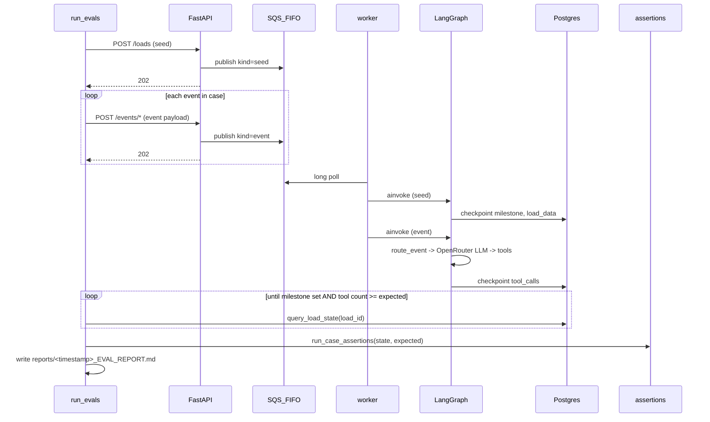
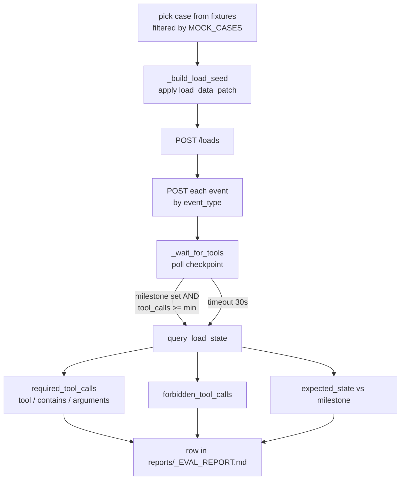

# Evals

Fixture eval harness for the FreightHero Watchtower take-home.

The harness drives fixture cases through the **real HTTP API → SQS → worker →
LangGraph → Postgres** stack and then reads each load's checkpoint to assert
the recorded tool trajectory and final milestone. It does **not** invoke the
graph in-process and there is no read HTTP API.

Run it with:

```bash
# prompts for an environment (default: local), then runs the suite
uv run python -m evals.run_evals

# skip the prompt
uv run python -m evals.run_evals --env local

# override the env's repetitions setting (otherwise read from config.yaml)
uv run python -m evals.run_evals --env local --repetitions 5

# point at an alternate fixtures JSON
uv run python -m evals.run_evals --env local --fixtures path/to/other.json
```

## Environment configuration

Environments live in [`config.yaml`](config.yaml). Per-env keys:

| Key | Purpose |
| --- | --- |
| `api_base_url` | Where the harness POSTs events and GETs checkpoint state. |
| `api_key` / `api_key_env` | Inline X-API-Key or env var holding it. Use `api_key_env` for non-local envs so secrets stay out of git. |
| `repetitions` | Default suite repetitions (override with `--repetitions`). |
| `poll_timeout_seconds` | How long `_wait_for_tools` polls the checkpoint endpoint per case. |

The CLI prompts at start-up; pass `--env <name>` to skip it. `default_env` at the top of the YAML controls which choice is highlighted in the prompt.

Secret values referenced via `api_key_env` are read from **`evals/.env`** (gitignored) at import time. Copy [`evals/.env.example`](.env.example) to `evals/.env` and fill in the keys. Shell-exported vars still win over the file (`override=False`).

The harness no longer connects directly to Postgres — it reads checkpoint state via `GET /loads/{load_id}/state` on the configured API. This is what makes pointing the harness at the prod ALB possible.

CLI flags:

| Flag | Default | Behavior |
| --- | --- | --- |
| `--env NAME` | _(prompt)_ | Environment name from `config.yaml`. Skips the interactive prompt. |
| `--config PATH` | `evals/config.yaml` | Alternate config file. |
| `--repetitions N` | _(from YAML)_ | Override the env's `repetitions`. When `N > 1`, launches N full-suite runs concurrently via `asyncio.gather` and emits a single aggregated markdown report. Exit code is `0` only if every suite-run fully passes. |
| `--fixtures PATH` | `evals/fixtures/test-cases.json` | Alternate fixtures JSON. |

Requires (local): API (`:8000`), worker, Postgres, and ElasticMQ/SQS all up,
plus an `OPENROUTER_API_KEY` so the worker can drive the live OpenRouter agent.
For a non-local env, only the configured `api_base_url` needs to be reachable;
the API container handles Postgres + SQS for you.
Assertions tolerate some live-model variation; pin temperature low if cases
flake.

### Parallel report layout

```
# Parallel Eval Report (N=5)
**Overall:** X/5 suite-runs fully passed — check score …

## Aggregated Summary
| Case | Run1 | Run2 | Run3 | Run4 | Run5 | Pass rate |
| ... | PASS | PASS | FAIL | PASS | PASS | 4/5 (80.0%) |

## Individual Runs
### Run 1 (run_id=`abcd1234`)
<single-run report body>
### Run 2 (run_id=`...`)
...
```

The aggregated grid surfaces per-case flakiness across N concurrent runs; the
individual sections retain the full per-case tool-call detail from the
single-run report.

### Harness unit tests

Pure-function tests live in [`tests/`](tests/) and exercise the path/patch
helpers, scoring, report builders, the aggregated-table grid, CLI parsing, and
both report-write paths via a stubbed `execute_suite` (no live stack):

```bash
uv run pytest evals/tests/
```

## Files

| File | Role |
| --- | --- |
| [`run_evals.py`](run_evals.py) | Harness entrypoint + CLI (`--env`, `--config`, `--repetitions`, `--fixtures`). Seeds loads via `POST /loads`, posts each event, polls `GET /loads/{load_id}/state`, runs assertions, writes either a single-run or an aggregated parallel report under `reports/`. |
| [`config.yaml`](config.yaml) | Environment definitions consumed by `env_config.py`. |
| [`env_config.py`](env_config.py) | Loads `config.yaml`, prompts (or skips via `--env`), produces an `EnvConfig`. |
| [`assertions.py`](assertions.py) | Pure assertion helpers: `assert_tool_called`, `assert_tool_forbidden`, `assert_state`, and the structured aggregator `evaluate_case`. |
| [`fixtures/test-cases.json`](fixtures/test-cases.json) | Visible challenge scenarios. Each case has `customer_id`, `initial_state`, optional `load_data_patch`, `events`, and `expected` (`required_tool_calls`, `forbidden_tool_calls`, `expected_state`). |
| [`tests/`](tests/) | Pytest unit tests for the harness pure helpers — no live stack needed (`uv run pytest evals/tests/`). |
| [`reports/`](reports/) | Auto-generated `<UTC-timestamp>_EVAL_REPORT.md` (single-run) or `<UTC-timestamp>_PARALLEL_EVAL_REPORT.md` (when `--repetitions > 1`) files — one per invocation, latest sorts to the top. |

Runtime dependencies:

| Module | Relationship |
| --- | --- |
| [`../app/api/routes.py`](../app/api/routes.py) | Write endpoints the harness posts to (`/loads`, `/events/inbound-communication`, `/events/tracking`, `/events/load-update`). |
| [`../app/api/routes.py`](../app/api/routes.py) | `GET /loads/{load_id}/state` — checkpoint reader used by the harness. |
| [`../app/worker/graph.py`](../app/worker/graph.py) | `query_load_state` is invoked **server-side** by the new endpoint. |

## Allow-Listed Cases

`run_evals.py` only runs cases listed in the `MOCK_CASES` set. New fixtures are
added explicitly so unverified branches don't silently pollute the report.
Current set:

```python
MOCK_CASES = {
    "3b_load_question_found",
    "3c_load_question_missing",
    "3d_truck_broken",
    "3k_broker_email_ignore",
}
```

Cases in `fixtures/test-cases.json` outside this set are still definitions —
they are exercised once the runtime supports their branch (routing, mock-model
keywords, tools), then added to `MOCK_CASES`.

## End-To-End Flow



The harness never talks to the worker directly — it only writes through the
HTTP API and reads through the Postgres checkpoint, mirroring how the
challenge rubric will exercise the system.

## Per-Case Pipeline



Key polling detail: `_wait_for_tools` gates on **both** `milestone` being set
and `len(tool_calls) >= min_count`. Without the milestone check, zero-tool
cases (e.g. `3k_broker_email_ignore`) would read the checkpoint before the
seed message landed and falsely fail the `expected_state` assertion.

## Fixture Shape

```json
{
  "id": "3d_truck_broken",
  "customer_id": "customer_a",
  "initial_state": "on_route_to_delivery",
  "load_data_patch": { "stops[1].reference_numbers.receiver_phone": null },
  "events": [ { "event_type": "inbound_communication", "...": "..." } ],
  "expected": {
    "required_tool_calls": [
      { "tool": "create_issue", "arguments": { "issue_type": "equipment_failure" } },
      { "tool": "send_sms", "contains": "review" }
    ],
    "forbidden_tool_calls": ["create_task", "update_eta", "update_load_state"],
    "expected_state": "on_route_to_delivery"
  }
}
```

- `load_data_patch` keys use dotted paths with `[index]` for arrays, applied
  by `_apply_patch` before the seed POST.
- `required_tool_calls` entries match against the tool name, an optional
  `contains` substring (matched against the stringified call), and an optional
  `arguments` subset.
- `forbidden_tool_calls` is a flat list of tool names that must not appear.
- `expected_state` is the final `milestone` (looked up at top level or under
  `load_state.milestone`).

## Assertions

| Helper | Behavior |
| --- | --- |
| `assert_tool_called(tool, contains?, arguments?)` | Fails if no `tool_calls` entry has the matching tool, or substring/argument subset don't match. |
| `assert_tool_forbidden(tool)` | Fails if any entry uses the forbidden tool. |
| `assert_state(milestone, expected)` | Direct equality on milestone. |
| `evaluate_case` | Runs all three, returns a `CaseResult` with per-check booleans plus the error list. `run_case_assertions` is a thin wrapper that returns just the errors (empty list = PASS). |

## Scoring

Per case: `score = (required_matched + forbidden_avoided + milestone_ok) / total_checks`, where `total_checks = len(required) + len(forbidden) + (1 if expected_state else 0)`. Extra tool calls that aren't in either list are ignored, so adding helpful but non-required tools never penalizes (or inflates) the score. The summary line in each report aggregates `checks_passed/checks_total` across all cases.

The Results table columns:

- **Required (matched/total)** — required tools satisfied vs declared.
- **Forbidden called** — count of forbidden tools that actually fired (`0` is good).
- **Milestone** — PASS/FAIL against `expected_state`.
- **Score** — equal-weight percentage of all checks for that case.

## Gotchas

- **Run as a module.** `uv run python evals/run_evals.py` fails with
  `ModuleNotFoundError: evals`. Use `uv run python -m evals.run_evals` (or the
  `Makefile` `eval` target). `run_evals.py` also injects the repo root into
  `sys.path` as a defensive fallback.
- **Live stack required.** The harness needs API, worker, Postgres, and
  SQS/ElasticMQ up. Missing the worker presents as the polling loop timing out
  after 30s with no `tool_calls`.
- **Live model variance.** OpenRouter responses are nondeterministic; pin
  temperature low and accept some tolerance in tool-call assertions, or trim
  the assertion set if a case is too strict.
- **Adding a fixture.** Update
  [`fixtures/test-cases.json`](fixtures/test-cases.json) and, if a new SOP
  section or tool is needed, the relevant runtime path (router in
  [`../app/worker/agent.py`](../app/worker/agent.py), any new tools in
  [`../app/tools/tools.py`](../app/tools/tools.py)) before promoting the ID
  into `MOCK_CASES`.
- **Reports are generated, never hand-edited.** Every run writes a new file
  under `reports/` named with a UTC timestamp so the latest sorts to the top.
  `--repetitions > 1` writes one aggregated `*_PARALLEL_EVAL_REPORT.md`
  instead of N separate single-run reports.
- **Parallel mode shares the live stack.** All N suite runs hit the same API,
  worker, Postgres, and SQS queue. Each run gets a unique 8-char `run_id` so
  `load_id`s never collide, but watch for backpressure (worker queue depth,
  Postgres connection pool) when pushing `--repetitions` high.
